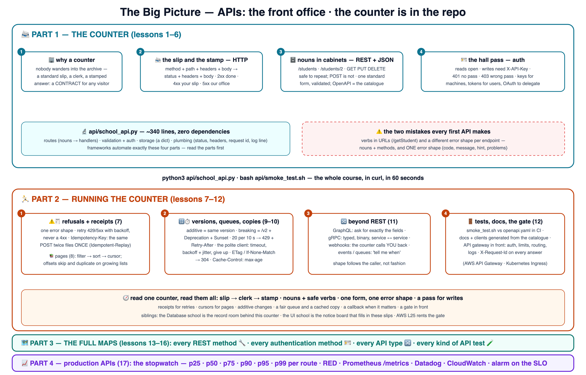

# 🏢 Learn APIs the School Way — the front office

The school method — proven on
[AWS](https://github.com/BaluRaut/learn-aws-school),
[Docker](https://github.com/BaluRaut/learn-docker-school),
[Kubernetes](https://github.com/BaluRaut/learn-kubernetes-school),
[MCP](https://github.com/BaluRaut/learn-mcp-school) and the rest of
[The School](https://baluraut.github.io/school/) — applied to **APIs**: how
programs talk to each other, taught as the school's **front office** — a slip at
the counter, a clerk, a stamped answer.

What makes this course different: **the counter is IN the repo.** A real HTTP/JSON
API in ~235 lines of pure Python, zero dependencies — you run it, curl it, break
it and extend it in every lesson.

🌐 **Interactive site:** **<https://baluraut.github.io/learn-api-school/>** —
lesson cards, every lesson as a numbered diagram, the big-picture 4K, a quiz, a
study plan, the before-and-trade-offs page, and
**[every API type](https://baluraut.github.io/learn-api-school/api-types.html)** —
REST, JSON-RPC, SOAP, GraphQL, gRPC, tRPC, OData, long polling, SSE, WebSocket,
WebRTC, webhooks, queues, event streams, batch files, libraries, system calls and
database drivers, on one page — plus **[every REST method](https://baluraut.github.io/learn-api-school/rest-methods.html)**
(GET, HEAD, OPTIONS, POST, PUT, PATCH, DELETE: safe · idempotent · cacheable) and
**[every authentication method](https://baluraut.github.io/learn-api-school/auth-methods.html)**
(Basic, API key, Bearer, JWT, cookie, OAuth 2.0, OpenID Connect, HMAC, mTLS).

> 🎒 **Prerequisites:** Python 3 and curl. Nothing else. Good neighbours: the
> [Database school](https://github.com/BaluRaut/learn-database-school) (the record
> room behind this counter) and the [UI school](https://github.com/BaluRaut/learn-ui-school)
> (the notice board that calls it).

## 🚀 The 60-second wow

```bash
python3 api/school_api.py          # terminal 1: the front office opens on :8080
bash api/smoke_test.sh             # terminal 2: the whole course, in curl
```

Every stamp the course teaches, live: 200 + ETag, 404 with one error shape, 401
without a hall pass, 400 with field-level problems, 201 with an Idempotency-Key
(and the same answer on retry), cursor pages, 304 on an unchanged copy, 204 twice
for an idempotent delete, and 429 when the queue is full.

## 🗺️ The big picture



## 🎓 The 12 lessons

Each numbered branch adds ONE lesson folder (`lessons/NN-topic/README.md`) with an
explain-like-I'm-5 story, a school analogy, a diagram, **What / Why / How**, a
hands-on lab on the real API, and Verify / Clean-up / Common-mistakes sections.
Branches are **sequential** — branch 07 contains lessons 01–07.

```bash
git checkout lesson-01-why-apis          # read lessons/01-why-apis/README.md, then...
git checkout lesson-02-http-anatomy      # ...keep going, one branch at a time
```

### Part 1 — the counter 📨

| # | Branch | You learn | Analogy |
|---|---|---|---|
| 01 | `lesson-01-why-apis` | Why a counter beats wandering into the archive; the contract | The front office 🏢 |
| 02 | `lesson-02-http-anatomy` | Method, path, headers, body; the four stamp families | The slip and the stamp 📨 |
| 03 | `lesson-03-rest-resources` | Nouns, collections, ids; safe and idempotent verbs | Filing cabinets 🗄️ |
| 04 | `lesson-04-json-and-schemas` | JSON, validation with field-level problems, OpenAPI | The standard form 📋 |
| 05 | `lesson-05-build-an-api` | Routes, checks, storage, plumbing — the four parts | Opening the counter 🔬 |
| 06 | `lesson-06-auth` | API keys, tokens, OAuth; 401 vs 403; least privilege | The hall pass 🪪 |

### Part 2 — running the counter 🏃

| # | Branch | You learn | Analogy |
|---|---|---|---|
| 07 | `lesson-07-errors-idempotency` | One error shape; retry rules; Idempotency-Key | Polite refusals, receipt numbers ⚠️🧾 |
| 08 | `lesson-08-pagination-filtering` | Filter → sort → paginate; cursors vs offsets | "The next 20, please" 📚 |
| 09 | `lesson-09-versioning` | Additive vs breaking; /v2; Deprecation and Sunset | New forms beside old 🔢 |
| 10 | `lesson-10-rate-limits-caching` | 429 + Retry-After, ETag/304, Cache-Control, timeouts, backoff | The queue and the copy ⏱️ |
| 11 | `lesson-11-beyond-rest` | GraphQL, gRPC, webhooks, events — the shape follows the caller | The counter calls you back 📣 |
| 12 | `lesson-12-testing-docs-gateway` | Contract tests, docs from the catalogue, request ids, the gateway | The school gate 🚪 |

## 📦 What's in this repo (main branch)

```
learn-api-school/
├── api/
│   ├── school_api.py         # the front office: a REAL HTTP/JSON API, ~235 lines, zero deps
│   ├── smoke_test.sh         # the whole course as a curl script (contract test)
│   ├── openapi.yaml          # the printed catalogue of every form
│   ├── client.py             # the polite client: timeouts, backoff + jitter, ETag cache
│   ├── webhook_receiver.py   # where the counter calls you back
│   ├── api_types.py          # the SAME five students as REST · JSON-RPC · GraphQL · long polling · SSE · WebSocket
│   ├── types_client.py       # one client that exercises all six and prints every byte
│   ├── methods_demo.sh       # all SEVEN REST methods against the counter, with the headers that prove each rule
│   ├── auth_demo.py          # the same grades behind SIX auth schemes: Basic · API key · Bearer · JWT · HMAC · cookie
│   ├── auth_client.py        # every header on the wire, an expired token, a forged JWT, a replayed request
│   └── expected-output.txt   # what a healthy run prints
└── docs/                     # the GitHub Pages site
```

Everything runs on your laptop. **Cost: zero.**

## 🔀 Every API type

This course builds **one** API — a REST counter. The
[every API type](https://baluraut.github.io/learn-api-school/api-types.html) page is the
map of all the other shapes, in four families: **ask & answer** (REST, JSON-RPC, SOAP,
GraphQL, gRPC, tRPC, OData), **stay on the line** (long polling, SSE, WebSocket, WebRTC),
**leave a message** (webhooks, queues, event streams, batch files) and **no network at all**
(libraries, system calls, database drivers, device APIs) — with a master table, a decision
guide, and the mistakes that pick the wrong one.

Six of them run right here, against the same five students:

```bash
python3 api/api_types.py        # terminal 1 — :8081
python3 api/types_client.py     # terminal 2 — REST · JSON-RPC · GraphQL · long polling · SSE · WebSocket
```

## 🔧 Every REST method · 🪪 every authentication method

The counter answers all seven methods — `PATCH` changes one field, `HEAD` gives the
headers only, `OPTIONS` lists what is allowed (and answers the browser's CORS preflight).
[Every REST method](https://baluraut.github.io/learn-api-school/rest-methods.html) draws
each one with the three words that tell them apart, the status codes it returns, and a
script that proves every rule:

```bash
python3 api/school_api.py        # terminal 1
bash api/methods_demo.sh         # terminal 2 — GET · HEAD · OPTIONS · POST · PUT · PATCH · DELETE
```

[REST API authentication methods](https://baluraut.github.io/learn-api-school/auth-methods.html)
draws nine ways to show a hall pass — Basic, API key, Bearer token, JWT, session cookie,
OAuth 2.0 with PKCE, OpenID Connect, HMAC request signing, mutual TLS — with 401 vs 403 and
the mistakes. Six of them run here, all guarding the same grades:

```bash
python3 api/auth_demo.py         # terminal 1 — :8082
python3 api/auth_client.py       # terminal 2 — every header, every 401 and 403
```

## 📜 License

MIT — see [LICENSE](LICENSE). Analogies are free to reuse; attribution appreciated.
