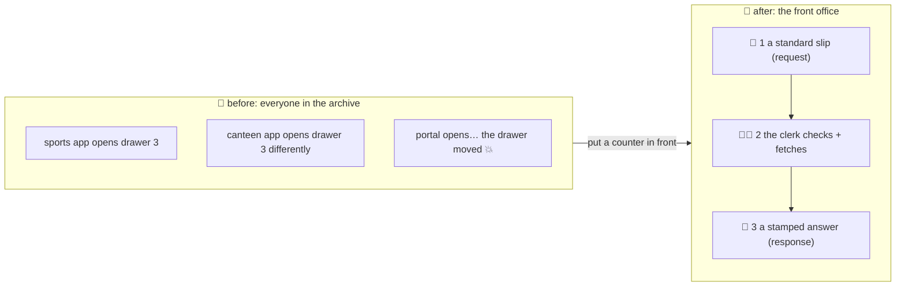

# 🏢 Lesson 01 — Why APIs: the front office

**📍 You are here:** Lesson **01** of 12 · Next: `lesson-02-http-anatomy`

---

## 📦 What's in this branch

The problem APIs exist to solve — and the one idea (a **contract at a
counter**) that explains every design choice in the rest of the course.
Real files you will use all the way through:

- [api/school_api.py](../../api/school_api.py) — the front office: a real HTTP/JSON API, ~235 lines, zero dependencies
- [api/smoke_test.sh](../../api/smoke_test.sh) — the whole course as a curl script

> 🎒 **Before you start:** you need **Python 3 and curl**, nothing else. This
> school teaches the *ideas* by running a tiny real API; frameworks (FastAPI,
> Express, Spring) automate the parts you will read here. Good neighbours:
> the [Database school](https://baluraut.github.io/learn-database-school/)
> (the record room behind this counter) and the
> [UI school](https://baluraut.github.io/learn-ui-school/) (the notice board
> that calls it).

## 🧒 Explain like I'm 5

Imagine the school archive 🗄️ — every register, every grade, every
timetable. In the bad old days, anyone who needed something **walked into
the archive** and opened drawers: the sports teacher, the canteen app, the
parents' portal, each with its own idea of where things were. Drawers got
rearranged; nobody logged who took what; when the archive moved a shelf,
three apps broke on the same morning.

So the school built a **front office** 🏢 with a counter. You do not enter
the archive any more. You fill in a **standard slip** ("student 2's grade,
please"), a **clerk** checks it, fetches the answer, and hands it back
**stamped** ("here you are — 200") or refused with a reason ("no such
student — 404"). The slip format never changes without notice; the clerk
does not care whether you are a teacher, a phone app or a robot.

That counter is an **API** (application programming interface). The slips
are **requests**, the stamped answers are **responses**, and the printed
rules of what slips exist and what they return are the **contract**. Every
lesson from here is about designing a good counter.

## 🗺️ Diagram



## ❓ What

- **API** = the contract at the counter: which slips exist (endpoints),
  what goes on them (parameters, body), what comes back (status + body).
- **HTTP** is the paper the slips are written on — lesson 02. **REST** is
  the filing convention for the cabinets — lesson 03. **JSON** is the form
  layout — lesson 04.
- The same counter serves every visitor: a web page, a phone app, another
  server, an AI agent ([MCP school](https://baluraut.github.io/learn-mcp-school/):
  MCP servers are often thin fronts over exactly this kind of API).
- Behind the counter is the archive — a database
  ([Database school](https://baluraut.github.io/learn-database-school/)).
  The counter's job is to keep visitors *out* of it.

## 🤔 Why

Because "just let the app read the database" is the most expensive
shortcut in software: every consumer couples to the storage layout, every
schema change is a coordinated outage, and there is no place to put
permission checks, rate limits, validation or logs. The counter is where
all of those live. Learn the counter and you can read any API in the world
— they are all slips and stamps.

## 🔧 How (in this repo)

The counter is `api/school_api.py`. It keeps five students in memory (the
archive, for now) and answers slips about them. You will read all of it in
lesson 05; today you only run it.

## 🧪 Try it (60 seconds — the whole course, live)

```bash
python3 api/school_api.py          # terminal 1: the office opens on :8080
bash api/smoke_test.sh             # terminal 2: every slip and stamp in the course
```

You should see, trimmed:

```text
── L02 · GET a student (200 + ETag)
HTTP/1.0 200 OK
{"id": 2, "name": "Sita", "class": "3A", "grade": "A+"}
── L02 · unknown id (404, one error shape)
{"error": {"code": "not_found", "message": "No student with id 99."}}
── L06 · write without a hall pass (401)
{"error": {"code": "unauthenticated", "message": "Writes need an X-API-Key header.", …}}
── L07 · create with an Idempotency-Key (201) … same key again → Idempotent-Replay: true
── L08 · page 1 then page 2 (cursor) …
── L10 · 40 quick requests → the queue says 429
200 200 … 429 429 429
```

## ✅ Verify — what you should see

Terminal 1 prints one log line per slip (`GET /v1/students/2 → 200 · 1 ms · <id>`); terminal 2 ends with a row of `200`s turning into `429`s. No stack traces. If port 8080 is busy, start with `python3 api/school_api.py 8081` and edit `B=` in the smoke test.

## 🏁 What you just proved

A real API is not magic: one Python file with no libraries answered every kind of slip this course will teach — and you read its answers by eye.

## ⚠️ Common mistakes

- running the smoke test with no server up — `curl: (7) Failed to connect` means terminal 1 is not running
- calling `http://localhost:8080/students` — this office lives under `/v1/`; the 404 body tells you so
- thinking the API *is* the database — it is the counter in front of it

> 🏭 **Why this matters in production:** every system you will meet — payments, maps, your company's own services — is a set of counters. Teams that treat the counter as a product (documented, versioned, guarded, observed) ship faster than teams whose apps rummage in each other's drawers.

## ⏭️ Next

What exactly is written on a slip and a stamp? **HTTP anatomy** — method,
path, headers, body, status.

```bash
git checkout lesson-02-http-anatomy
```
