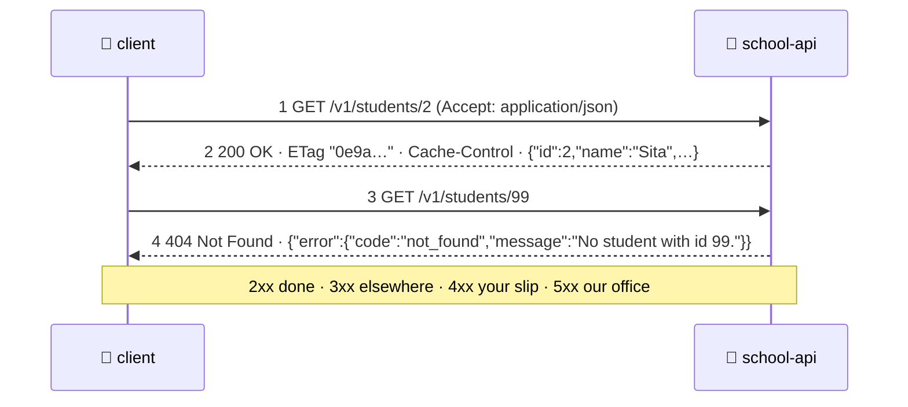

# 📨 Lesson 02 — HTTP anatomy: the slip and the stamp

**📍 You are here:** Lesson **02** of 12 · Previous: `lesson-01-why-apis` · Next: `lesson-03-rest-resources`

---

## 📦 What's in this branch

Lesson 01, **plus** the exact layout of a request and a response — the
five things on every slip and the three things on every stamped answer.

## 🧒 Explain like I'm 5

Every slip at the counter has the same boxes, always in the same order:

1. **What to do** — the **method**: `GET` (read), `POST` (add), `PUT`
   (replace), `DELETE` (remove).
2. **About what** — the **path**: `/v1/students/2`.
3. **Extra notes in the margin** — **headers**: "I speak JSON"
   (`Accept`), "here is my pass" (`X-API-Key`), "only if it changed"
   (`If-None-Match`).
4. **The form itself** — the **body**: only when you are adding or
   replacing something (`{"name": "Zoya", "class": "3B"}`).
5. **A query at the end** — `?limit=2&class=3A`: filters and options.

The clerk's answer has three parts: the **stamp** (a status code), some
**margin notes** (headers such as `ETag`, `Content-Type`, `Location`), and
the **contents** (the body, usually JSON). Stamps come in families:

- **2xx — done.** `200 OK`, `201 Created` (here is where it lives:
  `Location`), `204 No Content` (done, nothing to say).
- **3xx — go there instead.** `304 Not Modified` (your copy is still good).
- **4xx — YOUR slip is wrong.** `400` bad form, `401` no pass, `403` wrong
  pass, `404` no such thing, `409` conflict, `415` wrong paper, `429` too
  many slips.
- **5xx — OUR office is broken.** `500`, `502`, `503`, `504` — not your
  fault; try again later.

## 🗺️ Diagram



## ❓ What

- A request is text: a **request line** (`GET /v1/students/2 HTTP/1.1`),
  **headers** (one per line), a blank line, then the **body**. `curl -v`
  shows you exactly this.
- A response is text too: a **status line** (`HTTP/1.0 200 OK`), headers,
  blank line, body. `curl -i` prints the headers with the body.
- Headers are the margin notes both sides use to negotiate: format
  (`Content-Type`, `Accept`), identity (`Authorization`, `X-API-Key`),
  caching (`ETag`, `Cache-Control`), tracing (`X-Request-Id`).
- `Content-Type: application/json` is a promise about the body. Our API
  refuses a body that is not JSON with `415` — check
  `read_json()` in [school_api.py](../../api/school_api.py).
- Status codes are a **vocabulary**, not decoration: clients branch on
  them (retry a 503, never retry a 400 — lesson 07).

> 🔧 **All seven stamps, drawn:** GET, HEAD, OPTIONS, POST, PUT, PATCH and DELETE —
> safe, idempotent, cacheable, the status codes each returns, and a script that proves
> every rule against this counter — are
> [**lesson 13 — every REST method**](https://baluraut.github.io/learn-api-school/lesson-diagrams.html#l13). `bash api/methods_demo.sh`
> runs it (HEAD and OPTIONS answer too: try `curl -I` and `curl -X OPTIONS -i`).

## 🤔 Why

Because every tool in the trade — curl, browsers, load balancers, caches,
the AWS API Gateway, your framework — understands this exact layout.
Speak it fluently and you can debug any API with `curl -v` and no docs:
the method and path say what you asked, the status says whose fault it
is, the headers say what to do next.

## 🔧 How (in this repo)

`send(status, body, headers)` in `school_api.py` writes every stamp: the
status line, `X-API-Version`, `X-Request-Id`, `Content-Type`, the body.
`error(status, code, message)` writes every refusal in **one shape** —
lesson 07 explains why that matters so much.

## 🧪 Try it

```bash
python3 api/school_api.py                          # terminal 1
curl -v http://127.0.0.1:8080/v1/students/2        # terminal 2 — read the > and < lines
curl -i http://127.0.0.1:8080/v1/students/99       # the 404 stamp + the error body
curl -i -X POST http://127.0.0.1:8080/v1/students -d 'not json'   # 415: wrong paper
```

## ✅ Verify — what you should see

`curl -v` shows your request lines prefixed `>` (method, path, `Host`, `Accept`) and the answer prefixed `<` (`HTTP/1.0 200 OK`, `ETag`, `Cache-Control`, `Content-Type`). The 404 has a JSON body with `error.code = not_found`. The `-d 'not json'` call is refused with `415 unsupported_media_type` *before* auth is even checked.

## 🏁 What you just proved

You can read a request and a response as text, and you know which of the four stamp families each answer belongs to — that is 80 % of API debugging.

## ⚠️ Common mistakes

- reading only the body — the status code and headers carry half the meaning
- sending JSON without `Content-Type: application/json` — many servers, ours included, refuse it (415)
- treating 4xx and 5xx the same — one means fix your slip, the other means wait and retry

> 🏭 **Why this matters in production:** load balancers count 5xx, caches obey `Cache-Control`, alerting fires on error *rates per status family*. An API that returns `200` with `{"ok": false}` inside is invisible to every one of those tools.

## ⏭️ Next

How do we name the things on the slips? Nouns in filing cabinets —
**REST resources** and the verbs that are safe to repeat.

```bash
git checkout lesson-03-rest-resources
```
