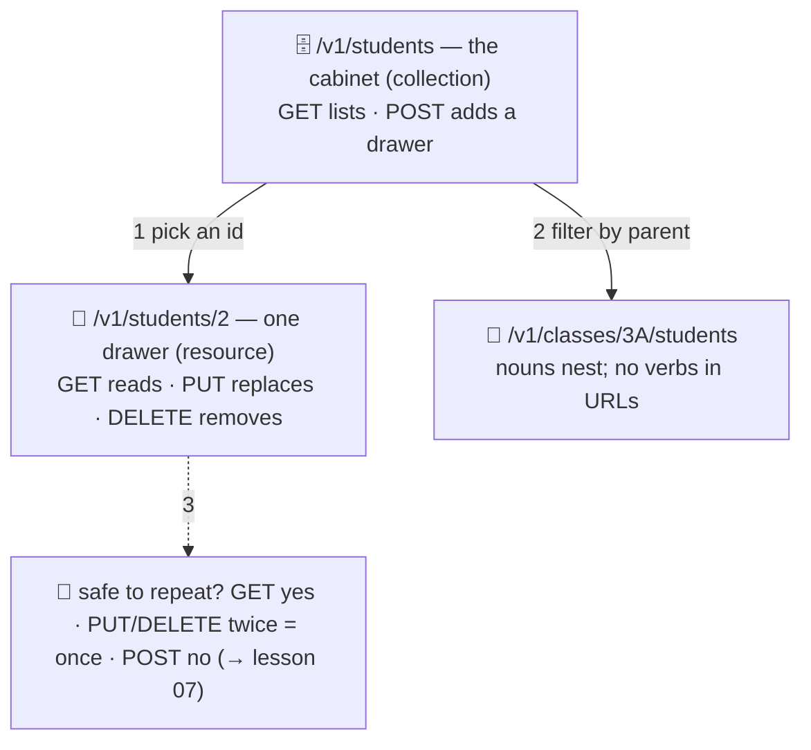

# 🗄️ Lesson 03 — REST resources: nouns in filing cabinets

**📍 You are here:** Lesson **03** of 12 · Previous: `lesson-02-http-anatomy` · Next: `lesson-04-json-and-schemas`

---

## 📦 What's in this branch

Lessons 01–02, **plus** the filing convention that makes any API
predictable: **resources** (nouns), **collections**, **ids**, and which
verbs are safe to repeat.

## 🧒 Explain like I'm 5

The archive has **cabinets** 🗄️, each cabinet has **drawers** 📁, and every
drawer has a **label**. The counter's slips name them the same way:

- `/v1/students` — the whole **cabinet** (a *collection*). `GET` lists it;
  `POST` adds a new drawer.
- `/v1/students/2` — **one drawer** (a *resource*). `GET` reads it, `PUT`
  replaces its contents, `DELETE` removes it.
- `/v1/classes/3A/students` — cabinets can nest: the students **of** a
  class.

The rule that makes it predictable: **URLs are nouns, methods are verbs.**
Never `/getStudent?id=2` or `/deleteStudent/2` — the verb is already in
the method. That is what people mean by **REST**.

And one more thing the clerk cares about: **is this slip safe to hand in
twice?**

- `GET` — safe: reading changes nothing.
- `PUT` and `DELETE` — **idempotent**: doing it twice leaves the same
  result as once (replace twice = replaced; delete twice = still gone,
  `204` both times).
- `POST` — **not** idempotent by itself: two "add Zoya" slips could file
  two Zoyas. Lesson 07 fixes that with a receipt number.

## 🗺️ Diagram



## ❓ What

- **Resource**: a thing with an identity and a URL. **Collection**: a
  set of them at the parent URL. Ids are opaque to clients — never
  assume they are sequential (ours are, for readability only).
- **Verb semantics** (what the counter promises): `GET` reads; `POST`
  creates (answer `201` + `Location`); `PUT` replaces the whole drawer;
  `PATCH` edits part of it (we skip PATCH — same idea); `DELETE` removes
  (answer `204`, and `204` again if it was already gone).
- **Idempotent** = the result after N identical calls equals the result
  after one. It is what lets a client *retry* on a dropped connection
  without fear.
- Nesting answers "of what?" — `/classes/3A/students` — but two levels
  is usually enough; deeper trees get replaced by filters
  (`/students?class=3A`, lesson 08).

> 🔧 **PUT vs PATCH vs POST, and the other four:** the counter now answers all seven
> methods — `PATCH /v1/students/2 {"grade":"A"}` changes one field, `HEAD` gives the
> headers only, `OPTIONS` lists what is allowed. Each is drawn, with the three words
> (safe · idempotent · cacheable) and its status codes, on
> [**every REST method**](https://baluraut.github.io/learn-api-school/rest-methods.html); `bash api/methods_demo.sh` proves
> every rule on the running counter.

## 🤔 Why

Predictability is the product. A developer who has never seen your API
can guess that `GET /v1/students/2` reads one student and
`DELETE /v1/students/2` removes it — and a proxy, a cache and a gateway
can guess the same, because the convention is shared. Verbs in URLs throw
that away and force everyone to read the PDF.

## 🔧 How (in this repo)

`route()` in `school_api.py` splits the path into nouns and ids
(`['students', '2']`); `do_GET`, `do_POST`, `do_PUT`, `do_DELETE` are the
verbs. Notice `do_DELETE` never checks whether the student existed:
`STUDENTS.pop(sid, None)` then `204` — that is idempotency in one line.

## 🧪 Try it

```bash
K='X-API-Key: hall-pass-123'; B=http://127.0.0.1:8080/v1
curl -s "$B/students?limit=10"                       # the cabinet
curl -s $B/students/2                                # one drawer
curl -s $B/classes/3B/students                       # nested nouns
curl -s -o /dev/null -w '%{http_code}\n' -X DELETE $B/students/5 -H "$K"   # 204
curl -s -o /dev/null -w '%{http_code}\n' -X DELETE $B/students/5 -H "$K"   # 204 again — idempotent
curl -s -X PUT $B/students/4 -H "$K" -H 'Content-Type: application/json' -d '{"name":"Meera","class":"3B","grade":"A+"}'
curl -s -X PUT $B/students/4 -H "$K" -H 'Content-Type: application/json' -d '{"name":"Meera","class":"3B","grade":"A+"}'   # same answer
```

## ✅ Verify — what you should see

Two `DELETE`s print `204` twice; two identical `PUT`s return the identical JSON (and the same `ETag` if you add `-i`). `GET /v1/classes/3B/students` lists only 3B. Restart the server (`Ctrl+C`, run again) to get student 5 back — the archive is in memory.

## 🏁 What you just proved

You can predict an endpoint's meaning from its noun and verb alone, and you have *felt* idempotency: repeating a safe slip changed nothing.

## ⚠️ Common mistakes

- verbs in URLs (`/createStudent`) — the method is the verb
- `GET` that changes state (`/students/2/delete`) — crawlers and prefetchers will "click" it
- returning `404` on the second `DELETE` — makes retries fail for no reason; `204` twice is correct
- deep nesting (`/schools/1/classes/3A/students/2/grades/3`) — use filters after two levels

> 🏭 **Why this matters in production:** idempotent verbs are what make retries, load-balancer failover and "at-least-once" queues safe. Every duplicate-order incident you have read about is a non-idempotent write retried by a well-meaning client.

## ⏭️ Next

What goes *on* the slip? The standard form — **JSON, validation, and the
printed catalogue (OpenAPI)**.

```bash
git checkout lesson-04-json-and-schemas
```
