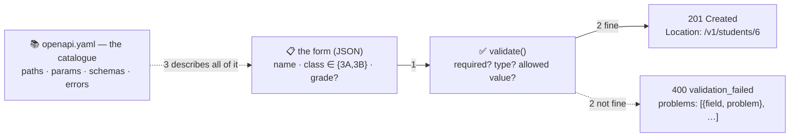

# 📋 Lesson 04 — JSON & schemas: the standard form

**📍 You are here:** Lesson **04** of 12 · Previous: `lesson-03-rest-resources` · Next: `lesson-05-build-an-api`

---

## 📦 What's in this branch

Lessons 01–03, **plus** the form itself: **JSON** bodies, **validation**
that refuses bad forms with a reason, and **OpenAPI** — the printed
catalogue of every form the counter accepts. Real file:

- [api/openapi.yaml](../../api/openapi.yaml) — the catalogue

## 🧒 Explain like I'm 5

The counter does not accept scribbled notes. To enrol a student you fill
in the **standard form** 📋:

```json
{"name": "Zoya", "class": "3B", "grade": "A"}
```

The clerk checks it **before** walking to the archive: is `name` filled
in? is `class` one of the classes we actually have (`3A`, `3B`)? is
`grade` one of the grades that exist? If not, the slip comes straight
back with a `400` stamp and a list of **exactly what is wrong**, field by
field — not a shrug, not a `500`, not "something went wrong".

And so nobody has to guess what the forms look like, the office prints a
**catalogue** of them — every path, every parameter, every field, every
stamp — in a standard layout called **OpenAPI**. Humans read it; tools
turn it into documentation, client libraries and tests.

## 🗺️ Diagram



## ❓ What

- **JSON**: objects `{}`, arrays `[]`, strings, numbers, booleans, `null`.
  No comments, no trailing commas, no dates (they are strings — agree on
  ISO 8601). `Content-Type: application/json` on both sides.
- **Validation** happens at the counter, not in the archive: required
  fields, types, allowed values (`enum`), ranges, formats. Refuse with
  `400` and a `problems` list; never let a half-valid form reach storage.
- **Schema**: the written shape of a form. In OpenAPI it is JSON Schema:
  `type`, `required`, `enum`, `minLength`, `default`.
- **OpenAPI** (`api/openapi.yaml`): `paths` → operations → `parameters`,
  `requestBody`, `responses`; `components/schemas` for the shared forms
  (`Student`, `StudentInput`, `Error`). One file describes the whole
  counter; lesson 12 uses it for docs and tests.
- Output is a form too: clients depend on field names and types you
  return. Adding a field is safe; removing or renaming one is not
  (lesson 09).

## 🤔 Why

Because the archive is the expensive part. A form checked at the counter
costs microseconds; a bad row written to the database costs a data
clean-up, and a `500` where a `400` belonged costs an on-call engineer an
hour. The catalogue is the other half: an API without a written contract
is a rumour.

## 🔧 How (in this repo)

`validate_student(body)` in `school_api.py` returns a list of
`{field, problem}` dicts; `do_POST` and `do_PUT` refuse with
`400 validation_failed` when the list is not empty. Compare it, line by
line, with `StudentInput` in `api/openapi.yaml` — they must always agree.

## 🧪 Try it

```bash
K='X-API-Key: hall-pass-123'; B=http://127.0.0.1:8080/v1; J='Content-Type: application/json'
curl -s -X POST $B/students -H "$K" -H "$J" -d '{"name":"","class":"9Z"}'        # 400 with two problems
curl -s -X POST $B/students -H "$K" -H "$J" -d '{"name":"Zoya","class":"3B"}'    # 201; grade defaults to C
curl -s -X POST $B/students -H "$K" -H "$J" -d '{"name":"Zoya","class":"3B","grade":"Z"}'   # 400: grade
# now change the contract: add a required "roll_no" field to validate_student() AND openapi.yaml, restart, retest
```

## ✅ Verify — what you should see

The first call returns `400` with `problems` naming `name` and `class`; the second returns `201` and a body with `"grade": "C"`; the third names `grade`. After your `roll_no` change, the second call fails until you add the field — and the catalogue says why.

## 🏁 What you just proved

The counter refuses bad forms with a field-level reason before any work is done, and the catalogue and the code describe the same form.

## ⚠️ Common mistakes

- validating in the database instead of at the counter — a constraint error becomes a 500
- one error message for every problem ("invalid input") — say which field and why
- a catalogue that drifts from the code — generate one from the other, or test them against each other (lesson 12)
- sending dates as `new Date()` strings — agree on ISO 8601 and time zones

> 🏭 **Why this matters in production:** contract-first teams generate client SDKs, mocks and tests from the OpenAPI file, so frontend and backend build in parallel. Contract-less teams discover field names in Slack.

## ⏭️ Next

Time to open the counter and read every line: **build an API** — the four
parts of `school_api.py`.

```bash
git checkout lesson-05-build-an-api
```
