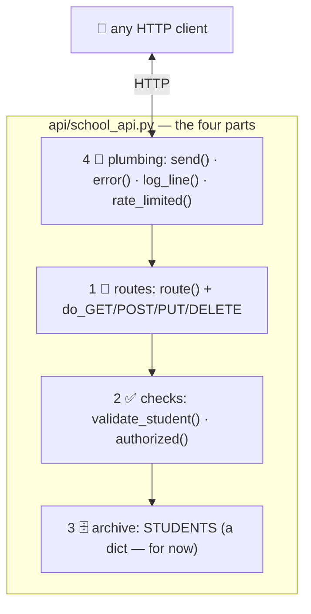

# 🔬 Lesson 05 — Build an API: the counter in ~235 honest lines

**📍 You are here:** Lesson **05** of 12 · Previous: `lesson-04-json-and-schemas` · Next: `lesson-06-auth`

---

## 📦 What's in this branch

Lessons 01–04, **plus** the guided read of the real counter —
[api/school_api.py](../../api/school_api.py) — and your first extension
to it.

## 🧒 Explain like I'm 5

Building a counter sounds like a framework's job, until you see one
opened up. Ours has exactly **four parts**, top to bottom of the file:

1. **The desk map** 🧭 — *routes*: `route()` turns `/v1/students/2` into
   `['students', '2']`, and `do_GET` / `do_POST` / `do_PUT` / `do_DELETE`
   decide which drawer the slip is about.
2. **The checks** ✅ — `validate_student()` (the form, lesson 04) and
   `authorized()` (the pass, lesson 06). Refuse politely *before* doing
   any work.
3. **The archive** 🗄️ — `STUDENTS`, a dict. Today it is memory; the
   Database school makes it durable. The counter does not care.
4. **The plumbing** 🔧 — `send()` writes every stamp with the same
   headers (`X-API-Version`, `X-Request-Id`, `Content-Type`); `error()`
   writes every refusal in one shape; `log_line()` prints one line per
   slip; `rate_limited()` is the queue (lesson 10).

That is a server. Frameworks give you decorators, typed models, docs
generators and async — use them for real work — but they are automating
these four parts, and now you have seen the parts.

## 🗺️ Diagram



## 📖 Read these lines (so you don't get lost)

- `validate_student` — part 2, the form
- `class Handler` → `send`, `error`, `log_line` — part 4, the stamps
- `rate_limited`, `authorized`, `read_json` — part 2/4, the gate keepers
- `route` and the four `do_*` methods — part 1, the desk map
- `list_students` — lesson 08 lives here
- `notify` — lesson 11's callback

## ❓ What (details worth stealing)

- **Refuse early, in order**: rate limit → path → auth → media type →
  JSON → validation → work. Each check is cheap and each has its own
  status code.
- **One `send()`** means every response carries the same headers — the
  request id alone will save you hours (lesson 12).
- **`ThreadingHTTPServer`** handles slips concurrently; the dict is safe
  enough for a lesson, and exactly the thing a real database replaces.
- **Status codes are decisions**: `201` + `Location` on create, `204` on
  delete, `304` on an unchanged ETag — each one is a line you can point at.
- Secrets come from the environment (`SCHOOL_API_KEY`), never from the
  code or the URL.

## 🤔 Why

Because "we need an API for X" is a sprint ticket in every team, and you
can now estimate it honestly: the plumbing is a day (a framework makes it
an hour); the real work is the **contract** — the nouns, the forms, the
error shape, the auth model. Teams that get those right ship counters
other teams enjoy calling.

## 🔧 How + 🧪 Try it — extend it for real

```bash
# 1) prove the baseline:
python3 api/school_api.py & sleep 1; bash api/smoke_test.sh | head -20
# 2) YOUR first endpoint — the homework cabinet. In school_api.py:
#    HOMEWORK = []                                      (part 3, next to STUDENTS)
#    in do_GET:  if p == ["homework"]: return self.send(200, {"items": HOMEWORK})
#    in do_POST: if p == ["homework"]: (authorized? read_json? require "title") → HOMEWORK.append(...); 201
# 3) restart and call it:
curl -s http://127.0.0.1:8080/v1/homework
curl -s -X POST http://127.0.0.1:8080/v1/homework -H 'X-API-Key: hall-pass-123' -H 'Content-Type: application/json' -d '{"title":"read lesson 06"}'
# 4) add the two operations to api/openapi.yaml — the catalogue must not lie
```

## ✅ Verify — what you should see

`GET /v1/homework` returns `{"items": []}`, the `POST` returns `201` with your item, and a second `GET` lists it. A `POST` without the key returns `401` — because you reused `authorized()`. The smoke test still passes: you added a cabinet without touching the others.

## 🏁 What you just proved

You extended a real API through all four parts — route, check, store, plumbing — and the existing contract kept working.

## ⚠️ Common mistakes

- doing work before the checks (writing to the dict, then validating)
- a new endpoint with its own error format — always `self.error(...)`
- forgetting `Content-Length` / `Content-Type` in hand-written responses — `send()` exists so you never do
- storing the API key in the source file

> 🏭 **Why this matters in production:** frameworks hide these parts behind decorators, which is wonderful until something is wrong at 3 AM. Engineers who know the four parts read framework stack traces as a map; the others read them as noise.

## ⏭️ Next

Who may hand in which slips? **Auth** — keys, tokens, OAuth, and the hall
pass for writes.

```bash
git checkout lesson-06-auth
```
