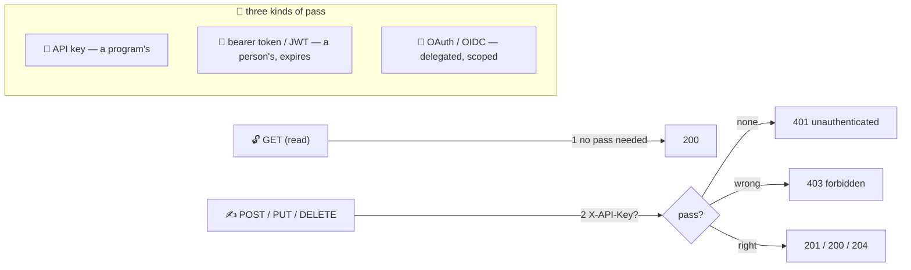

# 🪪 Lesson 06 — Auth: hall passes at the counter

**📍 You are here:** Lesson **06** of 12 · Previous: `lesson-05-build-an-api` · Next: `lesson-07-errors-idempotency`

---

## 📦 What's in this branch

Lessons 01–05, **plus** who may hand in which slips: **API keys**,
**bearer tokens / JWTs**, **OAuth**, and the two refusals that are not
the same thing (`401` vs `403`).

## 🧒 Explain like I'm 5

Reading the notice board needs no pass — anyone may `GET`. But **writing
in the register** (`POST`, `PUT`, `DELETE`) means showing a **hall pass**
🪪 at the counter. Our counter accepts one kind today: a header,
`X-API-Key: hall-pass-123`.

- No pass at all → **401 unauthenticated**: "who are you?"
- A pass, but not one that may write → **403 forbidden**: "I know who you
  are; you may not."

Real schools issue three kinds of pass, and you will meet all three:

1. **API key** 🔑 — a long random string given to a *program* (the
   canteen app). Simple, long-lived, revocable. Never put it in a URL, a
   log, or a browser — it is public the moment it ships in JavaScript.
2. **Bearer token / JWT** 🎫 — a signed, *expiring* pass issued to a
   *person* after they log in: `Authorization: Bearer eyJ…`. The server
   checks the signature instead of looking it up; it stops working by
   itself when it expires.
3. **OAuth 2 / OIDC** 🤝 — the *delegation* dance: "this calendar app may
   read my events, but not delete them", granted by the user on the
   provider's page, scoped, revocable. The CI/CD and AWS schools' OIDC
   badge is this same protocol used between machines.

Whatever the pass, the rule is **least privilege**: a key per app, scoped
to what it must do, rotated on a schedule, revoked the day it leaks.

## 🗺️ Diagram



## ❓ What

- **Authentication** = who is asking (the pass). **Authorization** = what
  they may do (the scope). `401` is an authentication failure, `403` an
  authorization one — never swap them.
- **API keys** travel in a header (`X-API-Key` or `Authorization: ApiKey`),
  never in the query string (URLs end up in logs and browser history).
  Store only a hash server-side; show the key once at creation.
- **JWT**: `header.payload.signature`, base64. The payload is *readable*
  (not secret!) — `sub`, `exp`, `scope`. The signature proves who issued
  it. Short expiry + refresh tokens is the standard pattern.
- **OAuth 2**: authorization code flow for apps acting for a user;
  client credentials for machine-to-machine; scopes name the permissions.
  **OIDC** adds "who is this user" on top.
- Transport: all of this is worthless without **TLS** (`https://`) — a
  pass shouted across the playground is not a pass.

## 🤔 Why

Because the counter is the only place that sees both the slip and the
pass. Put the check anywhere else — in the UI, in the database — and
somebody will find the door that skips it. And because `401`/`403`
confusion is not pedantry: clients *re-login* on 401 and *stop* on 403;
swap them and users loop forever or give up wrongly.

## 🔧 How (in this repo)

`authorized()` in `school_api.py`: missing header → `401`, wrong value →
`403`. The key comes from `SCHOOL_API_KEY` in the environment. Every
write handler calls it *after* the route check and *before* reading the
body — the order from lesson 05.

## 🧪 Try it

```bash
B=http://127.0.0.1:8080/v1; J='Content-Type: application/json'
curl -s -X POST $B/students -H "$J" -d '{"name":"Zoya","class":"3B"}'                              # 401
curl -s -X POST $B/students -H 'X-API-Key: wrong' -H "$J" -d '{"name":"Zoya","class":"3B"}'        # 403
curl -s -X POST $B/students -H 'X-API-Key: hall-pass-123' -H "$J" -d '{"name":"Zoya","class":"3B"}' # 201
# rotate the pass without touching code:
SCHOOL_API_KEY=new-pass-456 python3 api/school_api.py 8081 &
curl -s -X DELETE http://127.0.0.1:8081/v1/students/1 -H 'X-API-Key: hall-pass-123' -o /dev/null -w '%{http_code}\n'   # 403 — old pass
```

## ✅ Verify — what you should see

`401` with `hint: the hall pass is missing`, then `403` with `a pass, but not the right one`, then `201`. On port 8081 the old key gets `403` — you rotated a credential with an environment variable and zero code changes.

## 🏁 What you just proved

Reads and writes have different doors, the two refusals mean different things, and the pass lives outside the code.

## ⚠️ Common mistakes

- `403` for a missing pass (or `401` for a wrong one) — clients behave wrongly on both
- keys in query strings or committed to git — rotate immediately when it happens (it will)
- an API key in a browser app — use a user token; the key is public the moment it ships
- one god-key for every app — one key per app, scoped, so you can revoke *one* consumer
- HTTP without TLS anywhere a pass travels

> 🏭 **Why this matters in production:** most real API breaches are not clever — they are a key in a public repo, a token that never expired, or an endpoint that forgot to call `authorized()`. The boring rules above are the whole defence.

## ⏭️ Next

Part 2 begins: running the counter for real. First, **polite refusals and
receipt numbers** — errors, retries and idempotency keys.

```bash
git checkout lesson-07-errors-idempotency
```
