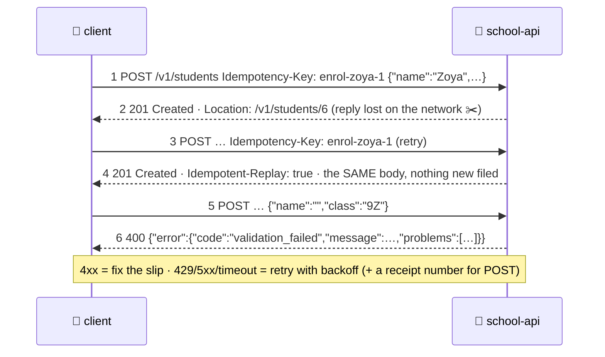

# ⚠️ Lesson 07 — Errors & idempotency: polite refusals and receipt numbers

**📍 You are here:** Lesson **07** of 12 — Part 2 begins! · Previous: `lesson-06-auth` · Next: `lesson-08-pagination-filtering`

---

## 📦 What's in this branch

Lessons 01–06, **plus** the two habits that separate a counter people
trust from one they curse: **one error shape, always**, and the
**receipt number** (`Idempotency-Key`) that makes retrying a `POST` safe.

## 🧒 Explain like I'm 5

When the clerk refuses a slip, the refusal is always written the same
way: a **code** the app can read (`validation_failed`), a **message** a
human can read ("The form has problems."), a **hint** when there is one,
and for forms, the **list of problems** field by field. Every refusal,
same layout — so every app can handle every refusal with the same code.

Now the retry problem. You hand in "enrol Zoya" and the line goes dead
before the stamp comes back. Did it get filed? If you hand it in again,
you might enrol two Zoyas. So the counter accepts a **receipt number**
on the slip — `Idempotency-Key: enrol-zoya-1`. If a slip with that
number was already processed, the clerk hands back **the same stamped
answer** and files nothing new (`Idempotent-Replay: true`). Now retrying
is always safe.

And the retry rules of thumb the polite client follows:

- **4xx** — your slip is wrong; retrying the same slip is pointless.
- **429 / 5xx / timeout** — the office is busy or broken; retry with
  **backoff and jitter** (lesson 10), and for `POST`, only with a receipt
  number.

## 🗺️ Diagram



## ❓ What

- **Error shape**: `{"error": {"code", "message", "hint"?, "problems"?}}`.
  `code` is a stable, machine-readable string (part of the contract);
  `message` may change. Some teams use the standard "problem details"
  format (RFC 9457) — same idea with standard field names.
- **Status vs code**: the status picks the family (`400`), the code picks
  the case (`validation_failed`, `bad_sort`, `invalid_json`).
- **Idempotency-Key**: a client-generated unique string per *intent*
  (one per "enrol Zoya", not per attempt). The server stores
  `key → response` for a while and replays it. Same key with a
  *different* body is a conflict (`422`/`409`) in strict APIs.
- **Never retry a 4xx** (except `429`, which is "not now"). **Retry**
  `502/503/504`, connection errors and timeouts — those are the office,
  not the slip.
- `5xx` must never leak stack traces; log them with the request id
  (lesson 12) and return the same error shape.

## 🤔 Why

Because clients are written against your *errors* as much as your
successes: a checkout page needs to know whether to say "fix your card
number" or "try again in a minute". One shape and honest status codes
make that a three-line `switch`; ad-hoc errors make it a guessing game.
And receipt numbers are how payment APIs avoid charging twice — the
pattern is older than REST and will outlive it.

## 🔧 How (in this repo)

`error()` in `school_api.py` is the single refusal writer. In `do_POST`,
`IDEMPOTENCY[key] = (201, student)` remembers the answer; the replay
branch at the top returns it with `Idempotent-Replay: true` before
reading the body at all.

## 🧪 Try it

```bash
K='X-API-Key: hall-pass-123'; B=http://127.0.0.1:8080/v1; J='Content-Type: application/json'
curl -si -X POST $B/students -H "$K" -H "$J" -H 'Idempotency-Key: enrol-zoya-1' -d '{"name":"Zoya","class":"3B"}' | sed -n '1p;/Location/p;$p'
curl -si -X POST $B/students -H "$K" -H "$J" -H 'Idempotency-Key: enrol-zoya-1' -d '{"name":"Zoya","class":"3B"}' | sed -n '1p;/Idempotent-Replay/p;$p'
curl -s "$B/students?limit=20" | grep -o '"name": "Zoya"' | wc -l      # 1, not 2
curl -s "$B/students?sort=age"                                         # 400 bad_sort — same shape
```

## ✅ Verify — what you should see

Two identical `201`s with the same `id`; the second carries `Idempotent-Replay: true`; the list contains **one** Zoya. The `sort=age` refusal has the same `{"error": {...}}` shape as every other refusal in the smoke test.

## 🏁 What you just proved

A dropped reply is no longer dangerous: with a receipt number, a retried `POST` files once. And every refusal your API makes can be handled by one piece of client code.

## ⚠️ Common mistakes

- a different error format per endpoint (`{"msg"}`, `{"errors": [...]}`, plain text) — clients give up on handling them
- `200` with `{"success": false}` — invisible to every monitoring tool (lesson 02)
- retrying a `POST` without a receipt number "just once" — that is the duplicate-order bug
- a new `Idempotency-Key` per *attempt* — the key must belong to the intent
- leaking stack traces in `5xx` bodies

> 🏭 **Why this matters in production:** Stripe, Adyen and every serious payment API require an idempotency key on `POST`, and the top complaint in any API forum is inconsistent errors. Copy both habits before you need them.

## ⏭️ Next

"The next 20, please" — **pagination, filtering and sorting** without
losing anyone.

```bash
git checkout lesson-08-pagination-filtering
```
