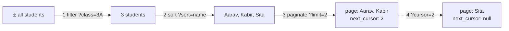

# 📚 Lesson 08 — Pagination & filtering: "the next 20, please"

**📍 You are here:** Lesson **08** of 12 · Previous: `lesson-07-errors-idempotency` · Next: `lesson-09-versioning`

---

## 📦 What's in this branch

Lessons 01–07, **plus** how a counter hands over a cabinet with ten
thousand drawers: **filter → sort → paginate**, and why **cursors** beat
**offsets** on anything that grows.

## 🧒 Explain like I'm 5

Nobody asks the clerk for "all the students". You ask for **the next
few**: `?limit=2`. The clerk hands over two drawers and a **bookmark** —
`next_cursor: 2`, "I stopped after id 2". Next time you say
`?limit=2&cursor=2` and get the two *after* that bookmark. When the
bookmark comes back `null`, the cabinet is finished.

Why a bookmark instead of "page 7"? Because the cabinet **grows while
you read it**. If a new student is filed while you are on page 3,
"page 4" now starts one drawer earlier — you see one drawer twice and
miss nothing, or miss one and see nothing twice, depending on the
direction. A bookmark ("after id 2") does not move when drawers are
added in front of it.

Two more slips the clerk accepts before paginating: **filter**
(`?class=3A` — only that class) and **sort** (`?sort=name`). The order is
always the same: filter, then sort, then take the next few.

## 🗺️ Diagram



## ❓ What

- **Response shape**: `{"items": [...], "next_cursor": …|null, "total": N}`.
  `total` is optional and can be expensive on big tables — many APIs omit
  it or make it approximate.
- **Cursor**: an opaque token that encodes "where I stopped". Ours is the
  last id (readable, for learning); real APIs base64-encode `(sort key,
  id)` so it works for any sort order.
- **Offset** (`?page=7&size=20` → `OFFSET 120`): simple, allows "jump to
  page 7", but skips or duplicates rows under inserts and gets slower the
  deeper you go (the database counts 120 rows to skip them).
- **Limit** always has a **maximum** (ours caps at 100) — otherwise
  `?limit=1000000` is a denial-of-service slip.
- Filters and sorts must be **allow-listed** (`sort ∈ {id, name, grade}`)
  — never pass a client string straight into a query.

## 🤔 Why

Because "return everything" is fine for 50 rows and fatal for 50,000:
timeouts, memory, and mobile apps rendering a spinner forever. And
because the growing-list bug is invisible in tests (tables do not grow
during a unit test) and obvious in production (a feed that repeats
items). Cursors cost one extra concept and remove a whole class of bugs.

## 🔧 How (in this repo)

`list_students()` in `school_api.py`: filter by `class`, allow-listed
`sort`, `limit` capped at 100, and a cursor on `id` when sorting by id
(an offset when sorting by another field — a deliberate simplification;
the What section says how real APIs generalise it).

## 🧪 Try it

```bash
B=http://127.0.0.1:8080/v1; K='X-API-Key: hall-pass-123'; J='Content-Type: application/json'
curl -s "$B/students?limit=2"                    # page 1 → next_cursor 2
curl -s "$B/students?limit=2&cursor=2"           # page 2 → next_cursor 4
curl -s "$B/students?limit=2&cursor=4"           # page 3 → next_cursor null
# the growing-list experiment: start paging, insert, keep paging — the cursor does not skip
curl -s -X POST $B/students -H "$K" -H "$J" -d '{"name":"Zoya","class":"3B"}' > /dev/null
curl -s "$B/students?limit=2&cursor=4"           # still starts after id 4 — Zoya appears at the end, once
curl -s "$B/students?class=3A&sort=name&limit=10"
curl -s "$B/students?limit=999999" | head -c 200 # capped, not exploded
```

## ✅ Verify — what you should see

Three pages of two, then `next_cursor: null`; after the insert, paging from `cursor=4` shows the new student exactly once at the end. The class filter returns three 3A students sorted by name; the huge `limit` returns at most 100 items.

## 🏁 What you just proved

Filter → sort → paginate, with a bookmark that survives inserts — and a cap that protects the counter.

## ⚠️ Common mistakes

- no maximum on `limit`
- offset pagination on a feed or log (skips and duplicates)
- sorting by any field the client names — allow-list it (SQL injection and slow queries hide here)
- returning `total` from a full table count on every page of a huge table
- changing the cursor's meaning between versions — it is part of the contract (even if opaque)

> 🏭 **Why this matters in production:** every "why did the app show that item twice?" ticket on an infinite-scroll feed is offset pagination. Cursors on an indexed column are how the big feeds scale — the Database school's lesson 06 is the index half of this story.

## ⏭️ Next

The counter must change without breaking the apps that already use it:
**versioning** — additive changes, `/v2`, deprecation and sunset.

```bash
git checkout lesson-09-versioning
```
