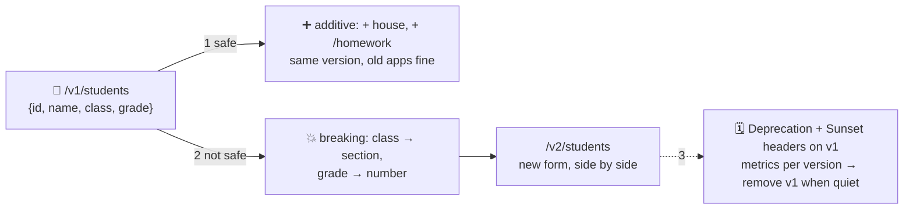

# 🔢 Lesson 09 — Versioning: new forms without throwing the old ones away

**📍 You are here:** Lesson **09** of 12 · Previous: `lesson-08-pagination-filtering` · Next: `lesson-10-rate-limits-caching`

---

## 📦 What's in this branch

Lessons 01–08, **plus** how a counter evolves without breaking the apps
that already fill in its forms: **additive changes**, **breaking
changes**, `/v1` → `/v2`, and the polite way to retire a form.

## 🧒 Explain like I'm 5

Twenty apps fill in the student form every day. One morning the office
wants a change. There are two kinds:

- **Adding a box** ➕ — a new optional field (`house`), a new endpoint
  (`/v1/homework`), a new value nobody is forced to use. Old apps keep
  working: they ignore boxes they do not know. **Safe. Same version.**
- **Changing or removing a box** 💥 — renaming `class` to `section`,
  making `grade` a number, deleting a field an app relies on. Old apps
  break the moment it ships. **Not safe. New version.**

So the office prints the new form as **`/v2`** and keeps handing out
`/v1` for a while. It announces the retirement politely: a
**`Deprecation`** note on every `v1` answer, a **`Sunset`** date, a
migration guide, and it watches the counter — `v1` is removed only when
no more `v1` slips arrive.

## 🗺️ Diagram



## ❓ What

- **Additive (non-breaking)**: new optional request fields, new response
  fields, new endpoints, new enum values *if clients were told to ignore
  unknown ones*. Relaxing a validation rule is usually safe; tightening
  one is breaking.
- **Breaking**: rename/remove a field, change a type or meaning, change
  a status code, change the error `code`s, change auth requirements,
  change cursor semantics.
- **Where the version lives**: the path (`/v1/`, visible, routable,
  cacheable — ours), or a header (`Accept: application/vnd.school.v2+json`,
  cleaner URLs, invisible in logs). Both work; pick one and never mix.
- **Deprecation** (`Deprecation: true`, `Sunset: <date>`, `Link:
  <migration guide>`) headers let clients detect it programmatically;
  usage metrics per version tell you when it is safe to remove.
- **Robustness on both sides**: servers ignore unknown *request* fields
  (or reject them consistently); clients ignore unknown *response*
  fields. That single habit makes most changes additive.

## 🤔 Why

Because an API is a promise to code you cannot see or update. A breaking
change without a version is a coordinated outage across every consumer —
the very thing the counter existed to prevent (lesson 01). Versioning is
not bureaucracy; it is how the office keeps its word while still moving.

## 🔧 How (in this repo)

Every path starts with `/v1/` (`VERSION` in `school_api.py`) and every
response carries `X-API-Version: v1`. Adding a field to `STUDENTS` and
`Student` in `openapi.yaml` is additive; renaming `class` would be your
first `/v2`.

## 🧪 Try it

```bash
# 1) additive: add "house": "red" to every student in STUDENTS and to the Student schema. Restart.
curl -s http://127.0.0.1:8080/v1/students/2            # old clients still parse this — they ignore "house"
# 2) breaking, done right — on paper (5 minutes):
#    write the /v2 form with "section" instead of "class", the Deprecation + Sunset headers you would add to v1,
#    and the one-paragraph migration note. Then decide the date you would remove v1 — and what metric tells you it is safe.
# 3) look at the version stamp:
curl -si http://127.0.0.1:8080/v1/health | grep -i x-api-version
```

## ✅ Verify — what you should see

After step 1 the smoke test still passes end to end (nothing it checks was renamed) and `house` appears in every student. Step 3 prints `X-API-Version: v1` on every answer. Your step-2 note names a field, a header, a date and a metric.

## 🏁 What you just proved

You can tell an additive change from a breaking one, ship the first on the same version, and plan the second without breaking anyone.

## ⚠️ Common mistakes

- "we'll just rename it, everyone will update" — nobody updates on your schedule
- versioning per endpoint or per field — one version for the whole counter
- keeping `/v1` forever with no metrics — you cannot retire what you cannot measure
- a `/v2` that changes everything at once — big rewrites stall; small breaking changes ship
- clients that fail on unknown fields — they turn every additive change into a breaking one

> 🏭 **Why this matters in production:** the APIs people love (Stripe, GitHub) have run old versions for years with published sunset dates. The ones people leave broke a field on a Tuesday.

## ⏭️ Next

The counter under load: **rate limits, caching, timeouts and backoff** —
the queue, the copy, and the polite client.

```bash
git checkout lesson-10-rate-limits-caching
```
