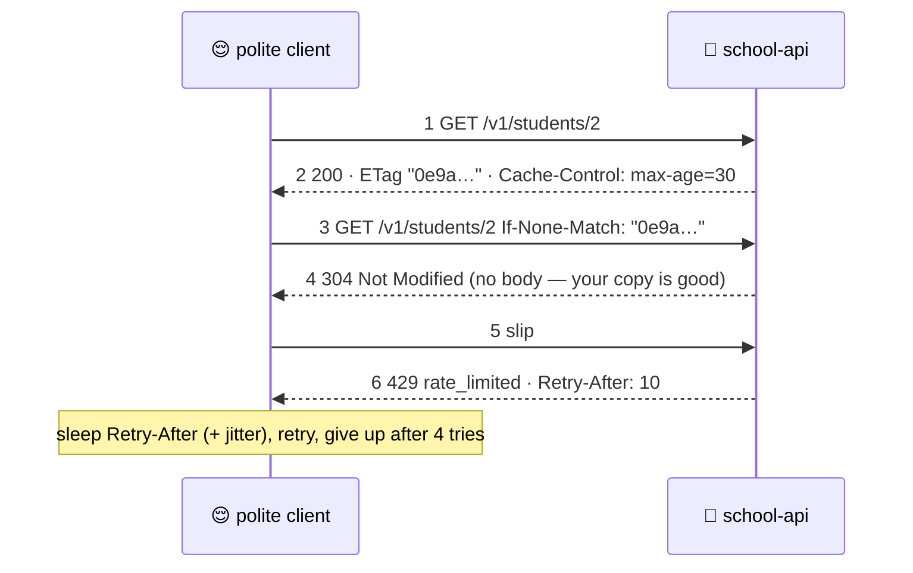

# ⏱️ Lesson 10 — Rate limits & caching: the queue at the counter

**📍 You are here:** Lesson **10** of 12 · Previous: `lesson-09-versioning` · Next: `lesson-11-beyond-rest`

---

## 📦 What's in this branch

Lessons 01–09, **plus** what happens when everyone arrives at once:
**rate limits** (`429`, `Retry-After`), **caching** (`ETag`,
`If-None-Match`, `Cache-Control`), **timeouts** and **backoff with
jitter** — and a polite client that does all of it. Real file:

- [api/client.py](../../api/client.py) — the polite client, ~45 lines

## 🧒 Explain like I'm 5

Three things keep the front office calm on a busy day:

1. **The queue** ⏱️ — each visitor may hand in **20 slips per 10
   seconds**. Slip 21 gets a `429 Too Many Requests` stamp with a note:
   `Retry-After: 10`. Nobody can empty the office by shouting.
2. **The copy** 🧾 — when you fetch a student, the stamp carries an
   **`ETag`**, a fingerprint of the answer. Next time you add "only if it
   changed" (`If-None-Match: "0e9a…"`) and, if it has not, the clerk
   answers `304 Not Modified` with no body: your copy is still good.
   `Cache-Control: max-age=30` goes further: for 30 seconds, don't even
   ask.
3. **The polite visitor** 😌 — never waits forever (**timeout** 3 s);
   when told `429` or when the office is broken (`5xx`), waits **longer
   each time with a little randomness** (backoff + jitter: 1 s, 2 s, 4 s
   …) instead of hammering the door; gives up after a few tries.

## 🗺️ Diagram



## ❓ What

- **Rate limiting**: a bucket per client (IP, key, or user) with a
  window; `429` + `Retry-After` when empty. Real gates use token buckets
  and share state across servers (lesson 12). Limits per **API key**
  beat limits per IP (many users share one NAT).
- **ETag / If-None-Match**: validation caching — one cheap round trip,
  no body. **Cache-Control: max-age**: expiration caching — zero round
  trips for that long. `private` = only the client may cache; `public` =
  CDNs and gateways may too.
- **Timeouts**: every call has one (connect + read). A missing timeout
  is a thread waiting forever.
- **Backoff with jitter**: `sleep(min(cap, base × 2ⁿ) + random)`. Jitter
  stops a thousand clients retrying in lockstep (the "thundering herd").
  Obey `Retry-After` when present.
- **Retry budget**: a few attempts, then a real error — infinite retries
  are an outage amplifier.

## 🤔 Why

Because an API without limits is one bug away from being down for
everyone, and a client without timeouts and backoff is the bug. Caching
is the same lesson from the other side: the cheapest slip is the one
never handed in. All three habits together are most of what "resilient"
means at the counter.

## 🔧 How (in this repo)

`rate_limited()` (bucket per client IP, `RATE_LIMIT` per 10 s, `429` +
`retry_after_seconds`), `etag_of()` + the `If-None-Match` check in
`do_GET`, and `Cache-Control` on every read. `api/client.py` shows the
client half: timeout, `If-None-Match` from its cache, backoff on `429`
and `5xx`, a retry budget of 4.

## 🧪 Try it

```bash
B=http://127.0.0.1:8080/v1
T=$(curl -si $B/students/2 | tr -d '\r' | awk -F': ' '/^ETag/{print $2}'); echo "etag $T"
curl -si $B/students/2 -H "If-None-Match: $T" | sed -n '1p'                 # 304
for i in $(seq 1 25); do curl -s -o /dev/null -w '%{http_code} ' $B/health; done; echo   # 200 ×20 then 429
curl -s $B/health                                                            # the 429 body: retry_after_seconds
sleep 10; python3 api/client.py                                              # 200, then 304 from cache, then 200s
RATE_LIMIT=3 python3 api/school_api.py 8081 & sleep 1; for i in 1 2 3 4 5; do curl -s -o /dev/null -w '%{http_code} ' http://127.0.0.1:8081/v1/health; done; echo
```

## ✅ Verify — what you should see

A `304` with no body; twenty `200`s then `429`s; a JSON error with `retry_after_seconds: 10`. `client.py` prints a `200`, then a `304` served from its own cache, then three `200`s — and if you run it while the bucket is empty, `429 → sleeping 1.7s (attempt 1)` lines that grow and stop. On port 8081 with `RATE_LIMIT=3`, the fourth call is `429`.

## 🏁 What you just proved

The counter stays fair under a flood, an unchanged answer costs no body, and a polite client waits, backs off and gives up on purpose.

## ⚠️ Common mistakes

- no timeout on outbound calls — the classic cause of "everything hung"
- retrying without jitter — every client retries at the same second
- retrying `4xx` (other than `429`)
- rate limiting only by IP — one office block behind a NAT gets limited as one user
- `Cache-Control: public` on personal data — a shared cache serves one user's page to another

> 🏭 **Why this matters in production:** the AWS API Gateway, Kubernetes Ingress controllers and every CDN implement exactly these headers and codes; the polite-client rules are the ones every SDK bakes in. Learn them once here, recognise them everywhere.

## ⏭️ Next

REST is not the only shape. **GraphQL, gRPC, webhooks and events** —
and when the counter calls you back.

```bash
git checkout lesson-11-beyond-rest
```
