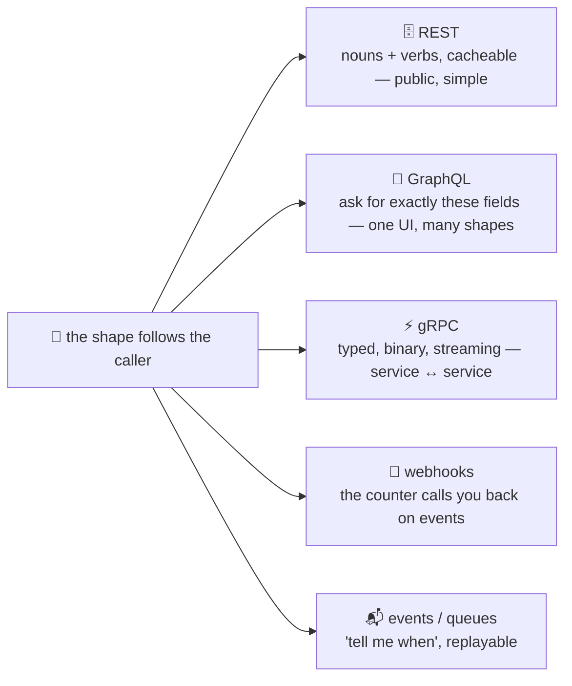

# 🔀 Lesson 11 — Beyond REST: when the counter calls you back

**📍 You are here:** Lesson **11** of 12 · Previous: `lesson-10-rate-limits-caching` · Next: `lesson-12-testing-docs-gateway`

---

## 📦 What's in this branch

Lessons 01–10, **plus** the other shapes a counter can take — **GraphQL**,
**gRPC**, **webhooks**, **events** — and the rule for picking one. Real
file:

- [api/webhook_receiver.py](../../api/webhook_receiver.py) — where the counter calls *you* back, barely a dozen lines

## 🧒 Explain like I'm 5

REST is one kind of counter: named drawers, standard slips. Three other
kinds exist, each for a real reason:

- **GraphQL** 🧩 — one window where you write *exactly* which boxes you
  want ("student 2: name and grade only, plus their class's teacher").
  Great when one screen needs bits of five drawers; the office has to do
  more thinking per slip.
- **gRPC** ⚡ — a fast internal hatch between two offices: typed forms
  (`.proto`), binary, streaming. Machines talking to machines inside the
  building, not the public counter.
- **Webhooks** 📣 — you leave your **phone number** at the counter
  ("call me when a student is enrolled"). When it happens, the office
  calls *you* (`POST` to your URL) instead of you asking every five
  seconds.
- **Events / queues** 📬 — the office puts a note in a **pigeonhole**
  every time something happens; anyone may read the pigeonhole later, in
  order. For "tell me when" at scale, with replay.

Picking is not fashion: **the shape follows the caller.**

## 🗺️ Diagram



## ❓ What

- **GraphQL**: one endpoint (`POST /graphql`), a query language, a typed
  schema, exactly-the-fields responses. Costs: caching is harder (no
  URL per resource), and unbounded queries need depth/cost limits.
- **gRPC**: HTTP/2 + Protocol Buffers; generated clients in every
  language; bidirectional streaming. Costs: not browser-native (needs a
  proxy), not curl-able, binary on the wire.
- **Webhooks**: the consumer registers a URL; the producer `POST`s events
  to it. The consumer must be reachable, verify a **signature**, answer
  fast (`2xx`) and tolerate **retries and duplicates** (make handling
  idempotent — lesson 07 again).
- **Events**: a log or queue (Kafka, SQS, RabbitMQ); consumers pull at
  their pace, with ordering and replay. Server-sent events (SSE) and
  WebSockets stream to browsers.
- **Polling** is what all of these replace: "anything new?" every N
  seconds — thousands of empty answers, and still late.

## 🤔 Why

Because teams pick shapes by fashion and pay for years: a GraphQL API for
a two-endpoint service, gRPC for a public API browsers must call, polling
where a webhook was one registration away. Know the four shapes and the
one rule, and the choice is usually obvious.

## 🔧 How (in this repo)

`POST /v1/webhooks {"url": …}` registers a URL; `notify()` in
`school_api.py` `POST`s a `student.created` event to every registered URL
after a successful enrolment — and swallows failures, because a dead
webhook must never break the counter. `api/webhook_receiver.py` is the
other side: a 15-line server that prints what arrives.

## 🧪 Try it

```bash
python3 api/webhook_receiver.py &                                    # terminal 3: your phone rings here on :9090
B=http://127.0.0.1:8080/v1; K='X-API-Key: hall-pass-123'; J='Content-Type: application/json'
curl -s -X POST $B/webhooks -H "$J" -d '{"url":"http://127.0.0.1:9090/hook"}'
curl -s -X POST $B/students -H "$K" -H "$J" -d '{"name":"Zoya","class":"3B"}' > /dev/null
# terminal 3 prints: 📣 webhook received: {'event': 'student.created', 'student': {...}}
kill %1                                                              # now the receiver is dead —
curl -s -X POST $B/students -H "$K" -H "$J" -d '{"name":"Yash","class":"3A"}' | head -c 80   # still 201: the counter survives
```

## ✅ Verify — what you should see

The receiver prints one `📣 webhook received` line with the new student; after you kill it, the next enrolment still returns `201` and the server's log shows `webhook … failed` — a failing callback never breaks the counter.

## 🏁 What you just proved

The counter can call you back, and you saw the two rules of webhooks from both sides: the producer never blocks on the consumer, and the consumer must expect retries.

## ⚠️ Common mistakes

- webhooks without a signature — anyone can `POST` fake events to your URL
- a webhook handler that does the work *before* answering `2xx` — answer fast, do the work after (a queue)
- assuming exactly-once delivery — de-duplicate by event id
- GraphQL without query depth/cost limits — one query can be a denial of service
- gRPC straight to browsers — you will end up writing the REST proxy anyway

> 🏭 **Why this matters in production:** payments, CI systems and chat platforms all deliver results by webhook; internal microservices talk gRPC; product UIs adopt GraphQL when screens outgrow endpoints. Recognising which shape a partner uses — and why — is a daily skill.

## ⏭️ Next

The last mile: **contract tests, docs from the catalogue, and the school
gate** (API gateway) in front of every counter.

```bash
git checkout lesson-12-testing-docs-gateway
```
