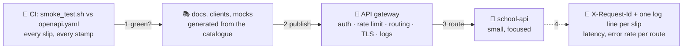

# 🚪 Lesson 12 — Testing, docs & the gateway: the school gate

**📍 You are here:** Lesson **12** of 12 — the final lesson! · Previous: `lesson-11-beyond-rest`

---

## 📦 What's in this branch

The complete course, **plus** the last mile: **contract tests** that run
in CI, **documentation generated from the catalogue**, **observability**
(request ids and log lines), and the **API gateway** — the school gate in
front of every counter.

## 🧒 Explain like I'm 5

Three things happen before a counter opens to the public:

1. **The inspector** 🧪 — someone hands in every kind of slip on purpose
   and checks every stamp against the catalogue. That is
   `api/smoke_test.sh` compared with `api/openapi.yaml`: a **contract
   test**. Run it on every change (the CI/CD school's checking desk).
2. **The printed guide** 📚 — the catalogue becomes the docs page, the
   client library and the mock server. Nobody writes the guide by hand.
3. **The gate** 🚪 — in front of the counter stands the **school gate**
   (an **API gateway**): it checks passes, keeps the queue, routes each
   slip to the right counter, and writes the log. The counter behind it
   stays small. The AWS school rents this gate as *API Gateway* (L25);
   the Kubernetes school's *Ingress* (L10) is the same idea.

And every slip leaves a trace: an `X-Request-Id` on the answer and one
log line at the counter — so "what happened to my slip at 14:03?" is a
grep, not a mystery.

## 🗺️ Diagram



## ❓ What

- **Contract test**: for each operation in the catalogue, at least one
  request and an assertion on status + body shape. Our smoke test is the
  human-readable version; tools can generate the same from OpenAPI.
- **Docs from OpenAPI**: renderers (Swagger UI, Redoc), generated SDKs,
  mock servers for frontend teams. The catalogue is the single source.
- **Observability at the counter**: a request id per slip (accept one
  from the gateway or mint one), a structured log line (method, path,
  status, ms, id), latency percentiles and error rate **per route**, and
  alerts on the `5xx` rate and `p95`.
- **API gateway**: auth (keys, JWT validation, OAuth), rate limits,
  routing/versions, TLS termination, WAF, request logs — centralised.
  Managed: AWS API Gateway; self-hosted: Kong, Envoy, NGINX, a
  Kubernetes Ingress with plugins.
- What stays *in* the API: validation, business rules, the error shape,
  idempotency. Gates enforce policy; counters enforce meaning.

> 🧪 **The full testing map:** this lesson builds the smoke test and the contract
> test. The other seven kinds — functional, integration, regression, load, stress,
> security, fuzz — and the UI kind are drawn one per row on the course's
> [**nine ways to test a counter**](https://baluraut.github.io/learn-api-school/api-types.html#testing)
> gallery, each with how you would run it against this counter.

## 🤔 Why

Because a counter without tests breaks silently, a counter without docs
gets called wrongly, a counter without a request id is undebuggable, and
five counters each re-implementing auth and rate limits is five sets of
bugs. The gate and the catalogue are how one small team runs many
counters safely.

## 🔧 How (in this repo)

`send()` mints `X-Request-Id` and `log_line()` prints the trace;
`api/smoke_test.sh` is the contract test; `api/openapi.yaml` is the
catalogue. The gateway is not in the repo — it is the piece you rent or
run in front (AWS L25, Kubernetes L10).

## 🧪 Try it — the capstone

```bash
# 1) make the smoke test a real check: exit non-zero when a stamp is wrong
#    (wrap each curl with an expected status; e.g. code=$(curl -s -o /dev/null -w '%{http_code}' …); [ "$code" = 201 ] || exit 1)
# 2) follow one slip end to end:
curl -si http://127.0.0.1:8080/v1/students/2 | grep -i x-request-id          # copy the id
#    …and find that id in terminal 1's log line: GET /v1/students/2 → 200 · 1 ms · <id>
# 3) render the catalogue: paste api/openapi.yaml into https://editor.swagger.io — every form, documented, for free
# 4) on paper: which of these does the gate do, which does the counter do?
#    check the API key · reject class "9Z" · 429 after 20 slips · add X-Request-Id · replay an Idempotency-Key · TLS
```

## ✅ Verify — what you should see

Your hardened smoke test exits `0` on the healthy API and `1` after you deliberately break a status code (change `201` to `200` in `do_POST` and watch it fail). The request id you copied appears in the server log. The rendered catalogue shows every path from the course with its schemas. Your paper answer: gate = key, 429, request id, TLS; counter = validation, idempotency replay.

## 🏁 What you just proved

The counter is testable, documented, traceable and ready to stand behind a gate — the four things that make an API safe to expose.

## ⚠️ Common mistakes

- tests that only check `200` — check the error stamps too; they are half the contract
- hand-written docs that drift from the code — generate from the catalogue
- business rules in the gateway — the gate enforces policy, the counter enforces meaning
- logs without a request id — every incident becomes archaeology
- no alert on the `5xx` rate — you learn about outages from customers

> 🏭 **Why this matters in production:** this is the checklist reviewers use before an API goes public: contract tests in CI, generated docs, request ids and per-route metrics, a gateway in front. Miss one and it becomes the incident.

## 🎓 The counter is yours

The archive → the counter → the slip and the stamp → nouns in cabinets →
the standard form → the four parts → the hall pass → receipt numbers →
"the next 20" → new forms beside old → the queue and the copy → the
callback → the gate. **You didn't just learn APIs — you run one.** 🏢🎓

Next doors in the school: the
[Database school](https://baluraut.github.io/learn-database-school/) makes
the record room behind this counter durable; the
[UI school](https://baluraut.github.io/learn-ui-school/) builds the notice
board that fills in these slips.

```bash
git checkout main
bash api/smoke_test.sh     # one last run, for fun
```
