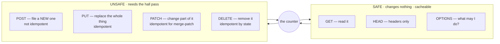

# 13 · 🔧 Every REST method — the seven stamps

> **Part 3 — the full maps.** Lessons 13–16 are the reference lessons: everything a
> working engineer meets beyond the one counter this course built in lessons 01–12.
> Each one has a full drawn map on the site and runnable code in this repo.

## 📦 What's in this branch

Lessons 01–13. The counter now answers **all seven** REST methods:

- [api/school_api.py](../../api/school_api.py) — `do_PATCH` (merge + validate), `do_HEAD` (headers only), `do_OPTIONS` (the Allow list and the CORS preflight)
- [api/methods_demo.sh](../../api/methods_demo.sh) — every method against the counter, with the headers that prove each rule
- [api/methods-output.txt](../../api/methods-output.txt) — what a healthy run prints
- 🗺️ **The full map:** [https://baluraut.github.io/learn-api-school/lesson-diagrams.html#l13](https://baluraut.github.io/learn-api-school/lesson-diagrams.html#l13) — each method drawn, the matrix, the status codes per method, PUT vs PATCH vs POST, the mistakes

## 🧒 Explain like I'm 5

The counter has **seven stamps**. Three of them only *look* at the cabinet — 📖 GET
reads a file, 👀 HEAD checks the file is there without opening it, ❓ OPTIONS asks
"what may I do here?". Four of them *change* the cabinet — ➕ POST files a **new**
form (and gives it a number), 🔁 PUT swaps a file for a **whole new one**, ✏️ PATCH
changes **one line** on a file, 🗑️ DELETE takes a file out.

Three words tell the stamps apart. **Safe**: does it change anything? **Idempotent**:
if I do it twice, is the cabinet the same as doing it once? **Cacheable**: may the
answer be kept and reused? The whole internet between you and the counter — browsers,
CDNs, proxies, retry libraries — believes those three promises. Break one and you
break them all at once.

## 🗺️ Diagram



## ❓ What

| Method | Does | Safe | Idempotent | Body in | Cacheable | Happy answer |
|---|---|---|---|---|---|---|
| GET | read a resource or a list | ✅ | ✅ | ❌ (query string) | ✅ | 200 · 304 |
| HEAD | GET's headers only | ✅ | ✅ | ❌ | ✅ | 200 · 304 |
| OPTIONS | allowed methods · CORS preflight | ✅ | ✅ | ❌ | ✅ (Max-Age) | 204 · 200 |
| POST | create · or perform an action | ❌ | ❌ unless Idempotency-Key | ✅ | ❌ | 201 + Location · 200 · 202 |
| PUT | replace the whole resource | ❌ | ✅ | ✅ all fields | ❌ | 200 · 204 |
| PATCH | change part of the resource | ❌ | ✅ for merge-patch | ✅ the changes | ❌ | 200 · 204 |
| DELETE | remove the resource | ❌ | ✅ by state | ❌ | ❌ | 204 · 202 |

TRACE and CONNECT exist in the RFC; a counter almost never implements them.

## 🤔 Why

Every intermediary trusts the three words. A GET that deletes is deleted by a
crawler. A POST used for reads cannot be cached. A PUT that is not idempotent
turns a harmless retry into corrupted data. Choosing the method **is** choosing
which promises you make to everything between you and your client.

## 🔧 How (in this repo)

- `do_PATCH` merges the body into the stored student, validates the **merged**
  result, and refuses unknown fields with a 400 — never a silent ignore.
- `do_HEAD` sets `head_only` and calls `do_GET`; `send()` writes the headers and
  skips the body, so `Content-Length` and `ETag` are exactly what GET would send.
- `do_OPTIONS` answers 204 with `Allow` and the `Access-Control-*` headers, which is
  what a browser asks before a cross-origin PUT, PATCH or DELETE (UI school, lesson 11).

## 🧪 Try it

```bash
python3 api/school_api.py &
bash api/methods_demo.sh
# then by hand:
curl -I http://127.0.0.1:8080/v1/students/2                                  # HEAD: headers, no body
curl -i -X OPTIONS http://127.0.0.1:8080/v1/students/2 | grep -i allow        # what may I do here?
curl -X PATCH http://127.0.0.1:8080/v1/students/2 -H 'X-API-Key: hall-pass-123' \
     -H 'Content-Type: application/json' -d '{"grade":"A"}'                  # one field only
```

## ✅ Verify — what you should see

`methods_demo.sh` prints one block per method: the same `ETag` on GET and HEAD, an
`Allow` list on OPTIONS, **two** `Location` headers from two POSTs, **one** student
from two PUTs, a 400 with `problems` for a one-field PUT, a merged student from
PATCH, a 400 for an unknown PATCH field, and `204 204 404` for DELETE, DELETE, GET.
The full text is in [api/methods-output.txt](../../api/methods-output.txt).

## 🏁 What you just proved

You watched the three words on the wire: safe methods answered without a hall pass,
idempotent methods gave the same state twice, and the one non-idempotent method
(POST) made twins — which is exactly why lesson 07 added the Idempotency-Key.

## ⚠️ Common mistakes

- A verb in the URL (`GET /students/5/delete`): a prefetching browser deletes data.
- PUT with a partial body that "keeps the rest": one client's missing field empties another's data.
- PATCH that ignores unknown fields: a typo in `grdae` returns 200 and saves nothing.
- 201 without a `Location` header; 200 with `{"ok": false}` inside for an error.
- Forgetting OPTIONS: every cross-origin write from the notice board fails with a CORS error.

> 🏭 **Why this matters in production:** retry libraries retry idempotent methods
> automatically and never retry POST; CDNs cache GET and HEAD and nothing else;
> browsers preflight with OPTIONS. Get the method right and all three do the right
> thing for free. Get it wrong and you debug a cache serving a deletion at 2 a.m.

## ⏭️ Next

**Lesson 14 — every authentication method:** the counter has one kind of hall pass;
the world has nine.
