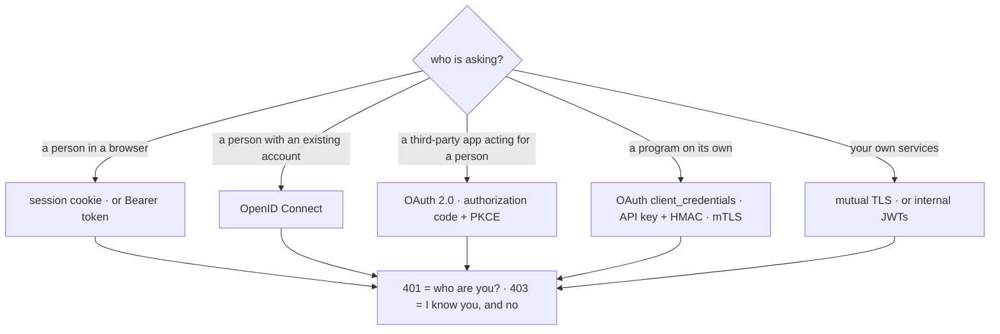

# 14 · 🪪 Every authentication method — every way to show a hall pass

## 📦 What's in this branch

Lessons 01–14. The same grades behind **seven** authentication schemes, zero dependencies:

- [api/auth_demo.py](../../api/auth_demo.py) — Basic · API key · opaque Bearer token · JWT (HS256) · HMAC request signing · session cookie · an OAuth 2.0 token endpoint (`client_credentials`, `refresh_token`; `password` refused)
- [api/auth_client.py](../../api/auth_client.py) — every header on the wire, an expired token, a forged JWT, a tampered signature, a replayed request, a scoped token refused a DELETE
- [api/auth-output.txt](../../api/auth-output.txt) — what a healthy run prints
- 🗺️ **The full map:** [https://baluraut.github.io/learn-api-school/lesson-diagrams.html#l14](https://baluraut.github.io/learn-api-school/lesson-diagrams.html#l14) — eleven flows drawn, the master table, every OAuth grant type, 401 vs 403, a decision guide, the mistakes

## 🧒 Explain like I'm 5

**Authentication** is "who is asking?"; **authorization** is "what may they do?".
Lesson 06 used one kind of hall pass — a program's key. But there are many ways to
prove who you are at the counter: say your name and password at every door (Basic);
show a program's key (API key); log in once and wear a wristband (Bearer token); wear
a wristband the office **signed** so any door can check it without a phone call (JWT);
let the browser carry a cookie for you (session); get a permission slip from the head
office so an app can act for you without your password (OAuth 2.0); "sign in with
Google" (OpenID Connect); seal and date every envelope (HMAC signing); or show
certificates at the gate before the door even opens (mutual TLS).

## 🗺️ Diagram



## ❓ What

| Method | What travels | Server keeps state? | Best for |
|---|---|---|---|
| Basic | user:password, base64, every request | no | scripts, internal tools — HTTPS only |
| API key | a long random string in a header | the key table | server-to-server, metering |
| Bearer token (opaque) | a token from /login | the token table | first-party apps; instant revoke |
| JWT | header.payload.signature | no — stateless | many services verifying one login |
| Session cookie | a session id (HttpOnly, SameSite, Secure) | the session table | browser apps on one site |
| OAuth 2.0 | code → access token (+ refresh) | the authorization server | third-party access, delegated scopes |
| OpenID Connect | an ID token (JWT) + access token | the identity provider | "sign in with…" |
| HMAC signing | a signature over method, path, time, body | the secret table | webhooks, AWS-style APIs |
| Mutual TLS | client + server certificates | a CA | service-to-service, zero trust |

**OAuth grant types:** `authorization_code` + PKCE for people, `client_credentials`
for programs, `refresh_token` to stay signed in, device code for screens without a
keyboard; `password` and `implicit` are removed in the OAuth 2.1 draft.

## 🤔 Why

Every method is a trade between **who keeps the state** and **how fast you can
revoke**. A stateful token table revokes instantly but costs a lookup; a signed JWT
scales without a lookup but lives until it expires. Picking by caller — person or
program — decides most of it.

## 🔧 How (in this repo)

`auth_demo.py` has one function per scheme, each returning `(user, role)` or raising
`Deny(challenge, why)`; the guard turns a `Deny` into a **401 with a
`WWW-Authenticate` challenge**, and a DELETE by a student (or by a token whose scope
is only `grades:read`) into a **403**. The token endpoint takes a *form*, not JSON,
as RFC 6749 requires, and answers `unsupported_grant_type` to the password grant.

## 🧪 Try it

```bash
python3 api/auth_demo.py &
python3 api/auth_client.py
# then by hand — the OAuth token endpoint speaks forms:
curl -s -X POST http://127.0.0.1:8082/token -d 'grant_type=client_credentials&client_id=report-bot&client_secret=s3cr3t-bot'
curl -s -X POST http://127.0.0.1:8082/token -d 'grant_type=password&username=teacher&password=chalk'   # refused
```

## ✅ Verify — what you should see

Seven labelled sections. Every missing or wrong credential is a **401 with a
`WWW-Authenticate` challenge**; the student's DELETE and the read-only OAuth token's
DELETE are **403**; the edited JWT fails with `bad signature`; the replayed HMAC
request is refused for its timestamp; `grant_type=password` gets
`unsupported_grant_type`. The full text is in [api/auth-output.txt](../../api/auth-output.txt).

## 🏁 What you just proved

You issued and verified every common credential with nothing but the standard
library — including a real JWT and a real OAuth token endpoint — and you saw the
difference between "who are you?" and "I know you, and no" on the wire.

## ⚠️ Common mistakes

- Basic or tokens over plain HTTP; API keys in browser JavaScript or URLs.
- Secrets inside a JWT payload (it is readable); long-lived JWTs with no way to revoke.
- Accepting `alg: none`; comparing tokens with `==` instead of `hmac.compare_digest`.
- Cookies without HttpOnly, Secure, SameSite; tokens in localStorage.
- The implicit flow or no PKCE; logging the `Authorization` header.

> 🏭 **Why this matters in production:** a wrong API key in lesson 06 answers 403;
> strictly an unknown key is a 401, and Stripe and GitHub answer 401. Both readings
> exist in the wild. What never varies: a 401 carries a challenge, a 403 names a
> known caller, and every credential has an expiry you decided on purpose.

## ⏭️ Next

**Lesson 15 — every API type:** this course built one REST counter; there are
twenty other shapes.
