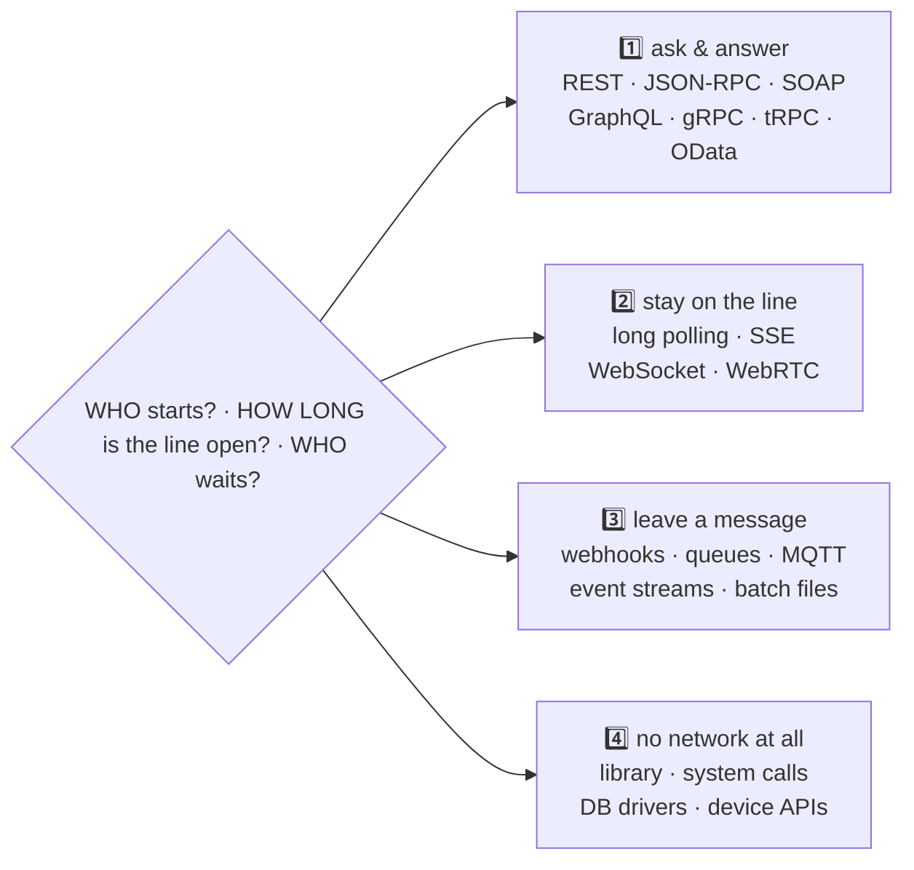

# 15 · 🔀 Every API type — one school, many counters

## 📦 What's in this branch

Lessons 01–15. The same five students served through **six API shapes**:

- [api/api_types.py](../../api/api_types.py) — REST · JSON-RPC · GraphQL-lite · long polling · Server-Sent Events · a real WebSocket (RFC 6455 handshake and frames)
- [api/types_client.py](../../api/types_client.py) — one client that exercises all six and prints every byte
- [api/api-types-output.txt](../../api/api-types-output.txt) — what a healthy run prints
- 🗺️ **The full map:** [https://baluraut.github.io/learn-api-school/lesson-diagrams.html#l15](https://baluraut.github.io/learn-api-school/lesson-diagrams.html#l15) — twenty types drawn one per row, the four families, the master table, by audience, by style, a decision guide, the mistakes

## 🧒 Explain like I'm 5

The school has more than one kind of counter. At the front office you **ask and get
an answer** (REST, RPC, GraphQL, gRPC, SOAP, tRPC, OData). On the phone you **stay on
the line** and the office keeps talking (long polling, Server-Sent Events, WebSocket,
WebRTC). At the pigeonholes you **leave a message** and nobody waits (webhooks,
queues, event streams, MQTT, the nightly van of batch files). And some counters are
**not on the network at all** — the tool in your own bag (a library), the building
manager (system calls), the wire to the record room (a database driver), the socket
in the wall (device APIs). Three questions place any API: who starts, how long does
the line stay open, and who waits.

## 🗺️ Diagram



## ❓ What

The master table on the full map has all twenty. The short version:

- **REST** nouns in cabinets · **RPC** a verb by name · **GraphQL** you write the shape of the answer · **gRPC** the typed internal hatch · **SOAP** the notarised envelope
- **Long polling** the clerk holds your question · **SSE** the loudspeaker · **WebSocket** the open phone line · **WebRTC** desk to desk
- **Webhook** you leave your number · **Queue** one reader · **Event stream** the logbook everyone replays · **MQTT** the PA system for tiny devices · **Batch** the nightly van
- **Library, system call, database driver, device** — contracts that never touch a network, and the same lessons apply

## 🤔 Why

Nobody picks a type by benchmark; they pick by who starts the conversation, how
fresh the answer must be, and whether a human is waiting. Placing an unfamiliar
technology on the four families tells you most of what it can and cannot do before
you read a line of its docs.

## 🔧 How (in this repo)

`api_types.py` is one `ThreadingHTTPServer` with six doors on the same data: a REST
route, a JSON-RPC method table, a GraphQL-lite resolver that returns only the fields
asked for, a long-poll that waits on a `Condition`, an SSE stream with `id:` frames
and `Last-Event-ID`, and a WebSocket that does the SHA-1 handshake and masks frames
by hand — about 160 lines, none of them magic.

## 🧪 Try it

```bash
python3 api/api_types.py &
python3 api/types_client.py
# then by hand:
curl -s -X POST http://127.0.0.1:8081/graphql -H 'Content-Type: application/json' -d '{"query":"{ students { name } }"}'
curl -N http://127.0.0.1:8081/events &   # a stream: enrol a student through JSON-RPC and watch it arrive
```

## ✅ Verify — what you should see

Six labelled sections: REST hands back whole resources; JSON-RPC returns an **error
inside a 200**; GraphQL returns **exactly the fields you named**; long polling answers
about 0.4 s late with one event; SSE prints `id:` / `event:` / `data:` frames and
replays history for `Last-Event-ID: 0`; the WebSocket shows `101 Switching Protocols`
then echoes both ways. Full text: [api/api-types-output.txt](../../api/api-types-output.txt).

## 🏁 What you just proved

The difference between API types is **who starts, how often, and how much comes
back** — not the data. You saw six wires carry the same five students.

## ⚠️ Common mistakes

- Choosing by popularity; polling every few seconds for rare events.
- A WebSocket for plain request/response; gRPC straight to browsers.
- A queue when the caller needs the answer now; webhooks without signatures or idempotency.
- Treating a library API as "not a real API" — versioning and deprecation apply to it too.

> 🏭 **Why this matters in production:** the shapes compose. A REST counter that
> enqueues a job, streams progress over SSE and finishes with a webhook is one
> architecture using each family for what it is good at — and a bad choice at any
> layer shows up as either an idle socket per client or a queue nobody drains.

## ⏭️ Next

**Lesson 16 — every kind of API test:** whatever its type, a counter is tested the
same nine ways.
