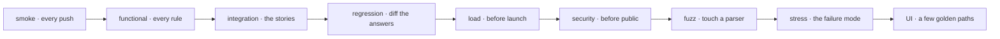

# 16 · 🧪 Every kind of API test — nine ways to test a counter

## 📦 What's in this branch

Lessons 01–16 — the whole course. Nothing new in `api/`: this lesson is about how to
use what is already there.

- [api/smoke_test.sh](../../api/smoke_test.sh) — the smoke test: 12 labelled checks in curl, one per lesson
- [api/methods_demo.sh](../../api/methods_demo.sh), [api/auth_client.py](../../api/auth_client.py), [api/types_client.py](../../api/types_client.py) — functional checks in disguise: each asserts a rule against the running counter
- 🗺️ **The full map:** [https://baluraut.github.io/learn-api-school/lesson-diagrams.html#l16](https://baluraut.github.io/learn-api-school/lesson-diagrams.html#l16) — the nine testing types drawn one per row, each with how to run it against this counter, and the order to adopt them

## 🧒 Explain like I'm 5

Before the school opens you **flick every light switch once** (smoke). Then you check
every rule in the handbook (functional), walk a whole day through the building
(integration), compare today's building with yesterday's photo (regression), fill the
hall with the expected crowd (load), then ten times that crowd to see what breaks and
whether it recovers (stress), try every door with the wrong key (security), use the
notice board the way a student would (UI), and finally feed the counter nonsense until
it flinches (fuzz).

## 🗺️ Diagram



## ❓ What

| Type | Asks | Against this counter |
|---|---|---|
| Smoke | does anything break at all? | `bash api/smoke_test.sh` — 12 checks, 30 seconds |
| Functional | does it do what the spec says? | a case per rule: duplicate email → 409, missing key → 401, one error shape |
| Integration | do several calls in a row work, with real neighbours? | enrol → read → update → delete → 404, with the webhook receiver running |
| Regression | did the change break what worked? | record the JSON of every answer; diff old build vs new |
| Load | what is the capacity? | k6 / hey at expected traffic; watch p95, errors, the 429s |
| Stress | how does it break, and does it recover? | 10× the load; are the failures polite 429s or crashes? |
| Security | every door, every lock | no key, wrong key, injection in every field, 1000 requests; check the logs |
| UI | through the notice board | the UI school's board fills the enrol form against this API |
| Fuzz | feed it nonsense | empty, huge, wrong types, unicode — any 500 or hang is a finding |

## 🤔 Why

Each type catches a class of bug the others cannot. Smoke catches "it does not start";
functional catches "the rule is wrong"; integration catches "the pieces disagree";
regression catches "we broke it last Tuesday"; load and stress catch "it falls over";
security catches "anyone can"; fuzz catches "the parser trusts input".

## 🔧 How (in this repo)

Every script in `api/` is a small test: `smoke_test.sh` checks one thing per lesson,
`methods_demo.sh` asserts the three words, `auth_client.py` asserts every 401 and 403,
`types_client.py` asserts six wire shapes. The CI/CD school runs the smoke test on
every push; the others are the habits you add as the counter grows.

## 🧪 Try it

```bash
python3 api/school_api.py &
bash api/smoke_test.sh                                                                  # smoke
for i in $(seq 1 40); do curl -s -o /dev/null -w '%{http_code} ' http://127.0.0.1:8080/v1/health; done; echo   # a tiny load test: watch the 429s begin
curl -s -X POST http://127.0.0.1:8080/v1/students -H 'X-API-Key: hall-pass-123' -H 'Content-Type: application/json' \
     -d '{"name":"","class":"9Z","grade":"Z"}'                                          # fuzz by hand: a 400 with problems, never a 500
```

## ✅ Verify — what you should see

The smoke test prints 12 labelled blocks and no `❌`. The load loop prints `200`s that
turn into `429`s after the bucket empties (lesson 10). The fuzz request answers `400`
with three `problems` — the counter flinching politely, which is the correct answer.

## 🏁 What you just proved

You ran three of the nine testing types against a real counter, and you know which
of the other six to add next and why: **smoke on every push, functional for every
rule, integration for the stories, regression by diffing, load before launch,
security before public, fuzz when you touch a parser, stress to learn the failure
mode, UI for a few golden paths.**

## ⚠️ Common mistakes

- Hundreds of end-to-end tests as the only tests; asserting on CSS classes instead of roles.
- Load testing from your laptop against localhost and calling the number "capacity".
- A fuzz run that treats a 400 as a failure — a 400 with problems is the counter working.
- Security tests only for the login endpoint; object-level access is where the leaks are.

> 🏭 **Why this matters in production:** the pyramid is many functional, some
> integration, few end-to-end — plus smoke on every deploy. Teams that skip regression
> ship the same bug twice; teams that skip fuzz ship a 500 for an emoji.

## 🎓 The full maps are complete — Part 4 measures the counter

`git checkout lesson-17-performance-monitoring` — latency percentiles and monitoring.

### Where you have been

Sixteen lessons: a counter built in twelve, and the four full maps that place
everything else. The [study plan](https://baluraut.github.io/learn-api-school/study-plan.html) ticks them off; the
[quiz](https://baluraut.github.io/learn-api-school/quiz.html) has a Part 3 for lessons 13–16; the
[School portal](https://baluraut.github.io/school/) has the certificate.
