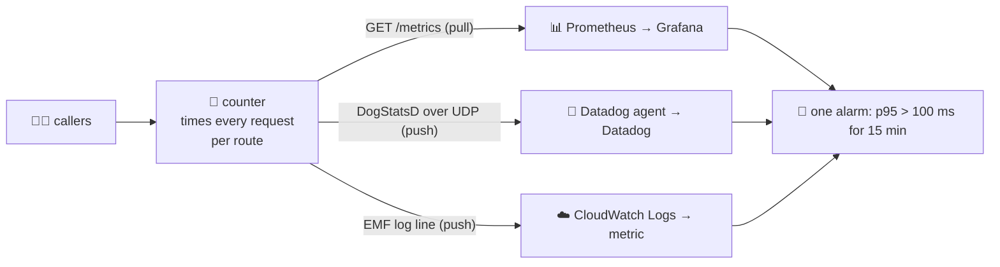

# 17 · 📈 Performance & monitoring — the stopwatch at the counter

> **Part 4 — production APIs.** Lessons 01–16 built the counter and mapped everything
> around it. Part 4 runs it under real traffic: measure it the way production does, and
> watch it with the tools teams actually use.

## 📦 What's in this branch

Lessons 01–17. The counter now measures itself:

- [api/school_api.py](../../api/school_api.py) — every response is timed and recorded per **route**
  (`/v1/students/{id}`, never the raw URL); `GET /metrics` serves them in the Prometheus format;
  `METRICS_EMF=1` prints a CloudWatch Embedded Metric Format line per request;
  `DOGSTATSD=127.0.0.1:8125` sends a Datadog DogStatsD packet per request. A new read,
  `GET /v1/reports/grades`, has a **simulated** slow path — 1 call in 15 "misses the cache"
  and takes ~150 ms — so there is a tail to find.
- [api/perf.py](../../api/perf.py) — starts the counter on a free port, sends 400 requests with 8
  callers at once, and prints p25 · p50 · p75 · p90 · p95 · p99 · max · mean overall and per route,
  a histogram, what `/metrics` says, the DogStatsD packets a Datadog agent would receive, a
  CloudWatch EMF line, and the same p95 alarm written for all three tools.
- [api/perf-output.txt](../../api/perf-output.txt) — one run on our laptop (your numbers will differ; the shape will not)
- 🗺️ **Drawn:** [https://baluraut.github.io/learn-api-school/lesson-diagrams.html#l17](https://baluraut.github.io/learn-api-school/lesson-diagrams.html#l17) — the sorted line of 104 requests with every percentile marked, and a lab to make requests slow yourself

## 🧒 Explain like I'm 5

The head teacher puts a **stopwatch** at the counter and writes down how long every
visitor waited. At the end of the day she **lines the times up, shortest to longest**.

- The visitor exactly in the **middle** of the line waited the **p50** (the median) — the typical visit.
- Stand **95 visitors in from the short end** of every 100: that time is the **p95**. Only 5 in 100 waited longer.
- **p99**: only 1 in 100 waited longer — the unlucky visitor who writes the complaint.
- p25 and p75 are the quarter marks; p90 is 1 in 10.

The **average** adds everything up and divides — and it hides the unlucky visitors. In our
run the report route's average was **18.9 ms** while **p95 was 135.8 ms**: most visitors
waited ~10 ms, but about 1 in 15 waited ~150 ms. The average said "fine". The visitors did not.

## 🗺️ Diagram



## ❓ What

- **Latency** — time from the request arriving to the response leaving (server side), or
  from sending to receiving (client side, which adds the network and the caller's own queue).
- **Percentiles** — sort the times; pN is the value N% of requests were at or below.
  `perf.py` uses linear interpolation between the two nearest ranks (numpy's default,
  Excel `PERCENTILE.INC`).
- **Per route** — one metric per method + path *template*. All routes mixed together, our
  run said p95 = **10.8 ms**; the report route alone was **135.8 ms**. Fast routes drown the slow one.
- **RED** — for every route: **R**ate (requests/s), **E**rrors (5xx %), **D**uration (p50/p95/p99).
- **Histograms, not averages** — percentiles cannot be averaged across servers. Prometheus
  keeps bucket counts and estimates (`histogram_quantile`); Datadog distributions and
  CloudWatch percentile statistics compute them centrally.
- **SLO** — the promise you alert on, e.g. "p95 of the report route under 100 ms over 15 minutes".

## 🤔 Why

Because people feel the tail, not the average. A route that is fast for 93 callers and slow
for 7 feels broken to those 7 — and they are the ones who leave. Measuring per route with
percentiles is how you find them before they write in.

## 🔧 How (in this repo) — three ways the numbers travel

| Tool | How it gets the number | What `perf.py` shows |
|---|---|---|
| 📊 **Prometheus + Grafana** | **pulls**: scrapes `GET /metrics` every ~15 s | `school_api_request_duration_seconds_bucket{route="/v1/reports/grades",le="0.25"} 104` |
| 🐶 **Datadog** | **push**: the app sends DogStatsD packets over UDP to the local agent | `school_api.request.duration:10.16\|d\|#method:GET,route:/v1/reports/grades,status:200` |
| ☁️ **CloudWatch** | **push**: one Embedded Metric Format JSON log line per request; CloudWatch turns it into a metric | `{"_aws": {… "Metrics": [{"Name": "Latency", "Unit": "Milliseconds"}]}, "Route": "GET /v1/reports/grades", "Latency": 10.4}` |

The same alarm — *p95 of the report route above 100 ms for 15 minutes* — in each tool:

```text
CloudWatch  aws cloudwatch put-metric-alarm --alarm-name school-api-report-p95 --namespace SchoolAPI \
              --metric-name Latency --dimensions Name=Route,Value='GET /v1/reports/grades' --extended-statistic p95 \
              --period 300 --evaluation-periods 3 --threshold 100 --comparison-operator GreaterThanThreshold
Datadog     percentile(last_15m):p95:school_api.request.duration{route:/v1/reports/grades} > 100
Prometheus  histogram_quantile(0.95, sum by (le) (rate(school_api_request_duration_seconds_bucket{route="/v1/reports/grades"}[5m]))) > 0.1
```

## 🧪 Try it

```bash
python3 api/perf.py                       # 400 requests, 8 callers
python3 api/perf.py 2000 32               # more traffic, more callers — watch p99 move
python3 api/school_api.py &               # then, in another terminal:
curl -s localhost:8080/v1/reports/grades; curl -s localhost:8080/metrics | grep reports
METRICS_EMF=1 python3 api/school_api.py 8081   # every request prints a CloudWatch EMF line on stdout
```

## ✅ Verify — what you should see

The per-route table puts `GET /v1/reports/grades` on top with p90 around 11 ms and p95/p99
around 136–156 ms, while the student routes stay near 1 ms. The all-routes p95 is ~11 ms and
only the all-routes p99 jumps to ~150 ms. `histogram_quantile` lands near the caller's p95 but
not exactly on it — buckets are coarse. About 400 DogStatsD packets are caught, one per request.

## 🏁 What you just proved

You can measure an API the way production does — percentiles per route — find the slow route
the average hid, and write the same SLO alarm in CloudWatch, Datadog and Prometheus.

## ⚠️ Common mistakes

- Alerting on the **mean** — it stays calm while the tail burns.
- One latency metric for the whole API — the slow route hides among the fast ones.
- Labels with user ids or raw URLs (`/v1/students/7`) — cardinality explodes and so does the bill; use the route template.
- **Averaging percentiles** across servers ("the mean of each server's p95") — mathematically wrong; merge histograms or distributions.
- Load-testing your laptop against localhost and calling the number "capacity" (lesson 16).
- p99 on 20 requests a minute — one request moves it; look at longer windows or p95.

> 🏭 **Why this matters in production:** every on-call team has a dashboard of RED metrics per
> route and alerts on SLOs written in percentiles — in Prometheus/Grafana, Datadog or
> CloudWatch (see the AWS school's lesson 18 and the Kubernetes school's lesson 26).

## ⏭️ Next

The counter is built, mapped and measured. The [study plan](https://baluraut.github.io/learn-api-school/study-plan.html) has week 6 for
this lesson; the [quiz](https://baluraut.github.io/learn-api-school/quiz.html) has a Part 4.
